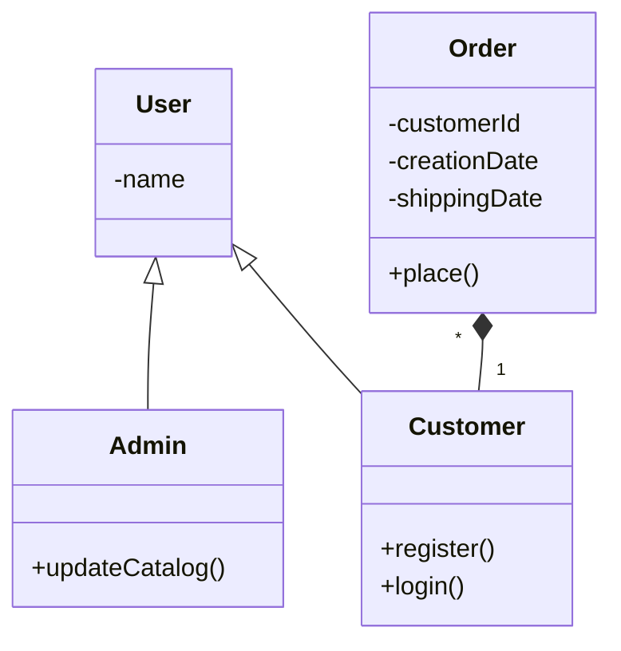
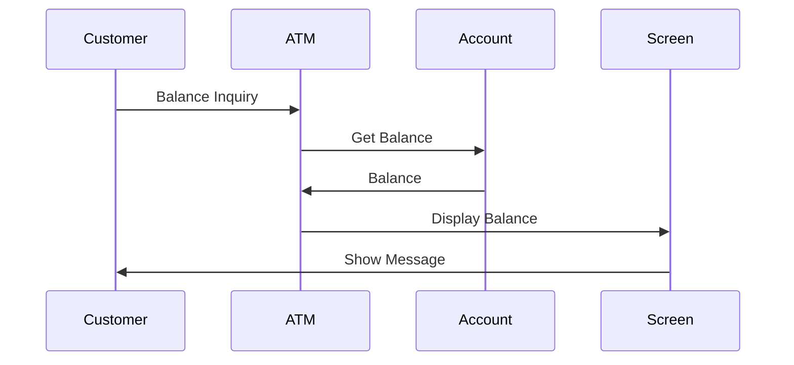

## Some Principles

- **dry** - don't repeat yourself - the code should be changed in a single place only
- **yagni** - you aren't gonna need it - do not introduce / foresee features you will not need in future, e.g. undo functionality
- **kiss** - keep it simple and stupid - e.g. when adding a task in a todo application, do not think about priority, deadline etc - highlight only the title and description fields, and hide the rest of them as optional fields

## SOLID Principles

### Single Responsibility Principle

- "a class should have only one reason to change"
- it should not handle multiple concerns
- this increases "cohesion" - only related code belongs together
- it improves readability
- it also makes writing focused tests easier

### Open Closed Principle

- "open for extension" - extend the functionality without touching existing code
- this is done using principles like composition, inheritance, etc
- "closed for modification" - do not add extra functionality to existing code, since it is already tested
- e.g. instead of bundling everything inside one class, have a generic `Writer` interface, and have different concrete implementations like `DBWriter`. for new functionality, we add a new writer `FileWriter` instead of touching the existing code

### Liskov Substitution Principle

- "sub classes should be able to substitute base classes"
- subclass should not reduce the feature set offered by base class, only increase it
- e.g. below violates liskov substitution -

```txt
class Vehicle {

  void startEngine() {}
}

class Bicycle extends Vehicle {

  void startEngine() {
    throw new RuntimeException("no engine present...");
  }
}
```

- solution - break into different interfaces - 

```txt
class Vehicle {}

class MotorVehicle {

  void startEngine() {}
}

class Bicycle extends Vehicle {}
```

### Interface Segregation Principle

- "clients should not be forced to depend on interfaces they do not use"
- this prevents "fat" interfaces
- example can be same as liskov above

### Dependency Inversion Principle

- "depend on abstractions, not concrete implementations"
- "decoupling" - modules will not have to change with change in underlying implementations
- "abstractions should not depend on details, but details should depend on abstractions"
- can be achieved through techniques like "dependency injection" - dependencies are provided to the class from outside instead of the class itself instantiating them
- thus implementations can also be swapped easily, e.g. - 

```txt
class Computer {

  private final Keyboard keyboard;
  private final Mouse mouse;

  Computer(Keyboard keyboard, Mouse mouse) {
    this.keyboard = keyboard;
    this.mouse = mouse;
  }
}

class BluetoothKeyboard implements Keyboard {}
class WiredKeyboard implements Keyboard {}

class BluetoothMouse implements Mouse {}
class WiredMouse implements Mouse {}
```

## Object Oriented Analysis and Design using UML

- procedural programming was about organizing code into blocks to help manipulate data
- oop organizes the code and wraps the data and functionality inside an object
- object oriented analysis - 
  - we identify the objects in a system
  - we establish the relationship between them
  - finally, we make the design that can be converted to executable code in our object oriented language
- uml or unified modelling language helps model the object oriented analysis
- it helps communicate design decisions easily by breaking down a complex system into smaller, understandable pieces

### Use Case Diagrams

- "use case" - set of actions the system can perform
- "actors" - external users of the system
- gives a high level functional behavior of the system
- models the relationship between actors and use cases, as well as between the different use cases
- "system boundary" - limit the scope of the system
- "include" - invocation of one use case by another use case (like invoking a method)
- "extend" - works like the base use case it extends with additional steps
- extend can also be used for conditional use cases. e.g. pay fine only on late returns, not all returns


### Class Diagram

- helps show how different entities relate to each other
- map directly to object oriented language
- the representation of class has three sections - class name, properties and methods
- "visibility" - we can put this ahead of the attributes / methods. `+` for public, `-` for private and `#` for protected and `~` for default
- "associations" - if two classes communicate with each other, there needs to be a link between them
- associations can be bidirectional (both classes are aware of each other) or unidirectional (only one class is aware)
- "multiplicity" - how many instances of the class participate in the relationship
- "inheritance" is also called an "is a" relationship. denoted by open arrows (the head is not filled)
- for abstract class, use italics
- composition / aggregation are also called a "has a" relationship
- "aggregation" - lifecycle of the child class is independent of the parent class. denoted by open arrows with diamonds at end
- "composition" - lifecycle of the child class is dependent on the parent class i.e. the child cannot exist independent of the parent. denoted by closed arrows with diamonds at end
- "generalization" - combining similar classes into a single class
- basic e.g. - 
  - inheritance between customer / admin and user
  - composition (with multiplicity) between orders and customers



### Sequence Diagrams

- sequence of interactions in terms of messages
- the vertical dimension represents the chronological order of the messages
- the horizontal dimension shows the messages that are sent
- used for "dynamic modelling" i.e. how objects interact with each other



### Activity Diagrams

- flow of control from one activity to another
- "activity" - an operation that results in a change of state
- used for "functional modelling" i.e. how inputs map to outputs


## Design Patterns Introduction

- problems that occur frequently have well defined solutions
- three broad categories - creational, structural, behavioral
- creational - how objects are constructed from classes
- structural - composition of classes i.e. how classes are constructed
- behavioral - interaction of classes and objects with one another and the delegation of responsibility

## Creational Patterns

### Builder Pattern

- separate the representation of object from its construction process
- e.g. helps prevent "telescoping constructors" - 
  ```txt
  Aircraft(Engine engine);
  Aircraft(Engine engine, Cockpit cockpit);
  Aircraft(Engine engine, Cockpit cockpit, Bathroom bathroom);
  ```
- "product" - what we want to create - aircraft here
- we have a "builder" interface
- implementations of this builder are called "concrete builders"
- the builder has empty / default implementations
- this way, the builder methods can be selectively overridden depending on variant
- "director" - has the "algorithm" to help create products using builders
- sometimes, the director can be skipped - the client invokes the methods on builder directly
- pretty similar to [abstract factory](#abstract-factory-pattern)

<details>
<summary>code example</summary>
<pre>
<code>
abstract class AircraftBuilder {

  void buildCockpit() {}
  void buildEngine() {}
  void buildBathroom() {}
  Aircraft getResult() {}
}
                                          // no bathrooms in f16
class BoeingBuilder                       class F16Builder {
    extends AircraftBuilder {                 extends AircraftBuilder {

  @Override void buildCockpit() {}          @Override void buildCockpit() {}
  @Override void buildEngine() {}           @Override void buildEngine() {}
  @Override void buildBathroom() {}         @Override Aircraft getResult() {}
  @Override Aircraft getResult() {}       }
}

class Director {

  AircraftBuilder aircraftBuilder;

  Aircraft construct(boolean isPassenger) {
    aircraftBuilder.buildCockpit();
    aircraftBuilder.buildEngine();
    if (isPassenger) {
      aircraftBuilder.buildBathroom();
    }
    return aircraftBuilder.getResult();
  }
}
</code>
</pre>
</details>

### Singleton Pattern

- create only one instance of a class
- e.g. thread pool, registries, etc
- we make the constructor "private" so that other classes cannot instantiate it
- some methods have been discussed below

<details>
<summary>not thread safe</summary>
<pre>
<code>
class AirForceOne {

  private static AirForceOne instance;

  private AirForceOne() { }

  public static AirForceOne getInstance() {

    if (instance == null) {
      instance = new AirForceOne();
    }

    return instance;
  }
}
</code>
</pre>
</details>

<details>
<summary>synchronized - makes code slow as every invocation acquires a lock</summary>
<pre>
<code>
synchronized public static AirForceOne getInstance() {
  // ...
}
</code>
</pre>
</details>

<details>
<summary>static initialization - if instantiation is expensive, it can cost us performance if object is never used</summary>
<pre>
<code>
private static AirForceOne instance = new AirForceOne();
</code>
</pre>
</details>

<details>
<summary>"double checked locking" - solves all problems, but not generally recommended</summary>
<pre>
<code>
class AirForceOne {

  // IMP - notice the use of volatile
  private volatile static AirForceOne instance;

  private AirForceOne() { }

  public static AirForceOne getInstance() {

    if (instance == null) {
      synchronized(AirForceOne.class) {
        if (instance == null) {
          instance = new AirForceOne();
        }
      }
    }

    return instance;
  }
}
</code>
</pre>
</details>

### Prototype Pattern

- create new objects by copying existing objects
- "prototype" - the seed object from which other objects get created
- sometimes, cloning can be more performant than creating entirely new instances
- another advantage - instead of too many subclasses, vary behavior by changing fields - two separate classes for boeing and f16 are not required below
- use case - "dynamic loading" - e.g. we do not have access to constructors. the runtime environment registers prototypes with the "prototype manager", so that whenever an object is requested, a copy is returned by this prototype manager
- "shallow" vs "deep" copy - nested fields would be shared in shallow copy unlike in deep

<details>
<summary>code example</summary>
<pre>
<code>
class F16 implements Aircraft {

  void setEngine(Engine engine) { }

  Aircraft clone() { /* deep copy */ }
}

Aircraft f16A = aircraft.clone();    Aircraft f16B = aircraft.clone();
f16A.setEngine(f16AEngine);          f16B.setEngine(f16BEngine);
</code>
</pre>
</details>

### Factory Method Pattern

- delegate the actual instantiation to subclasses
- the factory method may or may not provide a default implementation
- the subclass will override this implementation
- downside - compare with [prototype pattern](#prototype-pattern) - it results in too many subclasses

<details>
<summary>code example</summary>
<pre>
<code>
class F16 {

  protected Aircraft makeF16() {
    cockpit = new Cockpit();
  }
}

class F16A extends F16 {            class F16B extends F16 {

  @Override                           @Override
  public Aircraft makeF16() {         public Aircraft makeF16() {
    super.makeF16();                    super.makeF16();
    engine = new F16AEngine();          engine = new F16BEngine();
  }                                   }
}                                   }

F16 f16A = new F16B(); f16A.makeF16();
F16 f16B = new F16B(); f16B.makeF16();
</code>
</pre>
</details>

### Abstract Factory Pattern

- creating families of related objects without specifying their concrete classes
- we have "abstract factory" returning "abstract products"
- "concrete factories" override these abstract factory methods and return "concrete products"
- now, only the right concrete factory needs to be passed to the aircraft to construct it
- in [factory method pattern](#factory-method-pattern), we were using inheritance to create a single product
- here, we create a family of products using composition
- concrete factories can be [singleton](#singleton-pattern)

<details>
<summary>code example</summary>
<pre>
<code>
class Aircraft {

  void makeAircraft(AircraftFactory aircraftFactory) {
    engine = aircraftFactory.makeEngine();
    cockpit = aircraftFactory.makeCockpit();
  }
}

interface AircraftFactory {

  Engine makeEngine();
  Cockpit makeCockpit();
}

class BoeingAircraftFactory implements AircraftFactory {

  @Override Engine makeEngine() { return new BoeingEngine(); }
  @Override Cockpit makeCockpit() { return new BoeingCockpit(); }
}

class F16AircraftFactory implements AircraftFactory {

  @Override Engine makeEngine() { return new F16Engine(); }
  @Override Cockpit makeCockpit() { return new F16Cockpit(); }
}
</code>
</pre>
</details>

## Structural Patterns

### Adapter Pattern

- allows incompatible classes to work together by converting the interface of one class into another
- e.g. our aircraft business now needs to accommodate hot air balloons
- "adaptee" is the incompatible class - hot air balloon
- "target" is the interface the client (i.e. our code) understands - aircraft
- "adapter" is the class sitting in between, which is composed using adaptee and implements the target
- usually done after a system is designed to accommodate to fit additional requirements
- this entire process discussed above is called "object adapter"
- we can also use the "class adapter" pattern - where the adapter extends both the adaptee and the target
- disadvantage - multiple inheritance is not supported by java

<details>
<summary>code example</summary>
<pre>
<code>
interface Aircraft {

  void takeOff();
}

class Adapter implements Aircraft {

  HotAirBalloon hotAirBalloon;

  Adapter(HotAirBalloon hotAirBalloon) {
    this.hotAirBalloon = hotAirBalloon;
  }

  @Override
  void takeOff() {
    hotAirBalloon.inflateAndFly();
  }
}

// now, client can use adapter like any other `Aircraft`
</code>
</pre>
</details>

### Bridge Pattern

- helps separate abstraction and implementation into two different class hierarchies
- e.g. we have two shapes - circle and square
- now, we want to introduce two colors - blue and red
- we will end up with four classes - blue circle, blue square, red circle, red square
- this can grow exponentially
- another problem - changes to color and shape effect each other - they are not decoupled
- so, we split into two separate hierarchies - shape and color
- so, we have "abstraction" and "refined abstraction" (shapes)
- then, we have "implementation" and "concrete implementation" (colors)
- so, instead of inheritance, we use composition
- we compose the refined abstractions using the concrete implementations

<details>
<summary>code example</summary>
<pre>
<code>
class Shape {

  private Color color;

  Shape(Color color) {
    this.color = color;
  }
}

class Circle {              class Square {

  Circle(Color color) {       Square(Color color) {
    super(color);               super(color);
  }                           }
}                           }

interface Color {}
class Red implements Color {}
class Blue implements Color {}
</code>
</pre>
</details>

### Composite Pattern

- helps compose our model in a tree like structure and work with them
- e.g. an air force can have several levels of nested air forces, and ultimately the last level of air force would be composed of planes
- "composite" - helps model the trees / subtrees
- "leaves" - the last level in these trees
- "component" - both the leaf and composite are coded to this common interface
- now, the client can simply call `getPersonnel` and treat the composite / leaf as the same
- it uses [internal iterator](#iterator-pattern) - the iterator is not exposed, and is handled by the composite itself

<details>
<summary>code example</summary>
<pre>
<code>
interface Alliance {

  int getPersonnel();
}

class AirForce implements Alliance {

  private Alliance[] alliances;

  @Override
  int getPersonnel() {

    int personnel = 0;

    for (Alliance alliance : alliances) {
      personnel += alliance.getPersonnel();
    }

    return personnel;
  }
}

interface Aircraft { }

class F16 implements Aircraft, Alliance {

  @Override
  int getPersonnel() {
    return 2;
  }
}

class Boeing implements Aircraft, Alliance {

  @Override
  int getPersonnel() {
    return 10;
  }
}
</code>
</pre>
</details>

### Decorator Pattern

- extend the behavior of an object dynamically
- the decorator basically adds to the existing functionality, by for e.g. taking some action before / after invoking the method on the wrapped component
- alternative to creating more subclasses
- e.g. below, the luxury and bulletproof variants could have been subclasses of boeing as well
- but then we could not wrap a different aircraft with different decorators
- "component" - the common interface to which the component and decorator is coded
- "concrete component" - what we wrap
- "decorator" - an interface for different decorators. this will also extend the component
- "concrete decorator" - the actual implementation of decorators. they wrap the concrete components
- we can wrap using multiple decorators as well
- e.g. below, we can make an aircraft bulletproof and luxurious, which affects its weight but its flying method stays the same
- the advantage is that the client code is agnostic of all this - it still codes to component
- notice how the decorator is composed using the component

<details>
<summary>code example</summary>
<pre>
<code>
interface Aircraft {
  
  void fly();
  
  int getWeight();
}

class Boeing implements Aircraft {    class F16 implements Aircraft {

  @Override                             @Override
  public void fly() {                   public void fly() {
    System.out.println("flying");         System.out.println("soaring");
  }                                     }

  @Override                             @Override
  public int getWeight() {              public int getWeight() {
    return baseWeight;                    return baseWeight;
  }                                     }
}                                     }

abstract class Decorator implements Aircraft { }

class BulletProofDecorator extends Decorator {

  Aircraft aircraft;

  @Override
  public void fly() {
    aircraft.fly();
  }

  @Override
  public int getWeight() {
    return aircraft.getWeight() + 13;
  }
}

class LuxuriousDecorator extends Decorator {

  Aircraft aircraft;

  @Override
  public void fly() {
    aircraft.fly();
  }

  @Override
  public int getWeight() {
    return aircraft.getWeight() + 27;
  }
}

Aircraft boeing = new Boeing();
Aircraft ceoPlane = new BulletProofDecorator(new LuxuriousDecorator(boeing));
boeing.getWeight(); // cumulated weight
</code>
</pre>
</details>

### Facade Pattern

- a single uber interface to a subsystem to make working with it easier
- the client will now interface with the "facade" and not worry about the complexities of the subsystem
- changes to the subsystem will now affect the facade and not the client

<details>
<summary>code example</summary>
<pre>
<code>
class AutopilotFacade {

  private BoeingAltitudeMonitor altitudeMonitor;
  private BoeingEngineController engineController;
  private BoeingNavigationSystem navigationSystem;

  AutopilotFacade(BoeingAltitudeMonitor altitudeMonitor,
      BoeingEngineController engineController, 
      BoeingNavigationSystem navigationSystem) {
    this.altitudeMonitor = altitudeMonitor;
    this.engineController = engineController;
    this.navigationSystem = navigationSystem;
  }

  void autopilotOn() {
    altitudeMonitor.autoMonitor();
    engineController.setEngineSpeed(700);
    navigationSystem.setDirectionBasedOnSpeed(engineController.getEngineSpeed());
  }

  void autopilotOff() {
    altitudeMonitor.turnOff();
    engineController.turnOff();
    navigationSystem.turnOff();
  }
}
</code>
</pre>
</details>

### Flyweight

- sharing state among objects for efficiency
- e.g. if we use a global radar to track air crafts, we will end up with too many air craft objects for the same air craft at different coordinates
- "intrinsic state" - independent of the context of object. e.g. top speed of the air craft
- "extrinsic state" - dependent of the context of object. e.g. coordinates of the air craft
- so, to prevent creation of too many objects, we store intrinsic state inside the object, while extrinsic state outside it
- this way, we automatically end up with less objects, since we only need new objects when the intrinsic state changes, and not every time the extrinsic state changes
- "flyweight" - the object has become light since it only stores intrinsic state now
- "flyweight factory" - used to create the flyweight objects, because we do not want the client to create them directly
- "context" - used to store the extrinsic state

<details>
<summary>code example</summary>
<pre>
<code>
class F16 implements IAircraft {

  private final int topSpeed = 800;

  int getTimeToDestination(int curX, int curY, int destX, int destY) {
    int distance = ...;
    return distance / topSpeed;
  }
}
</code>
</pre>
</details>

### Proxy Pattern

- calls to the "real subject" are hidden behind a "proxy"
- this way, the real subject is shielded from the client
- both implement the "subject" interface so that the client code does not change
- e.g. client will call methods like turn left and turn right on remote control
- the remote control will call these methods on the drone
- both of them implement an interface called `IDrone`
- "remote proxy" - when the real subject is located on a remote server, the calls made by the client actually reaches a proxy first
- the proxy sits on the same jvm, and the proxy then makes the request over the network to the real subject on the remote server
- "virtual proxy" - delays the object creation when it is expensive
- e.g. we see loading overlays or wire frames with same height and width while expensive pictures are loading
- "protection proxy" - acts as an authorization layer in between

## Behavioral Patterns

### Chain of Responsibility Pattern

- decoupling the sender of a request from its receiver
- passing it along a chain of handlers till one of the handlers handle it or the request falls off the chain and remains unhandled
- use this pattern when a request can be handled by multiple objects and it is not known in advance which one will end up handling it
- we have a "handler" which all "concrete handlers" implement
- notice how all handlers maintain a reference to their successor 

<details>
<summary>code example</summary>
<pre>
<code>
class ErrorCodes {

  static final int LOW_FUEL = 1;
  static final int HIGH_ALTITUDE = 2;
}

class Handler {

  Handler next;

  Handler(Handler next) {
    this.next = next;
  }

  void handleRequest(int errorCode) {
    if (next != null) {
        next.handleRequest(errorCode);
    }
  }
}

class LowFuelHandler extends Handler {          class HighAltitudeHandler extends Handler {

  LowFuelHandler(Handler next) {                  HighAltitudeHandler(Handler next) {
    super(next);                                    super(next);
  }                                               }

  void handleRequest(int errorCode) {             void handleRequest(int errorCode) {
    if (errorCode == ErrorCodes.LOW_FUEL) {         if (errorCode == ErrorCodes.HIGH_ALTITUDE) {
      // ...                                          // ...
    } else {                                        } else {
      super.handleRequest(errorCode);                 super.handleRequest(errorCode);
    }                                               }
  }                                               }
}                                               }
</code>
</pre>
</details>

### Observer Pattern

- "observers" subscribe to "subjects" for state changes
- so, we have "observer" and "concrete observers", "subject" and "concrete subjects"
- "push model" - the subject will push the new state into the observer when calling its update method
- "pull model" - the subject will call the observer's update method using itself i.e. `this`
- then, the observer can call the getter method on the subject which can expose individual bits of state

<details>
<summary>code example</summary>
<pre>
<code>
interface ISubject {

  void addObserver(IObserver observer);

  void removeObserver(IObserver observer);

  void notifyObservers();
}

interface IObserver {

  void update(Object newState);
}

public class ControlTower implements ISubject {

  List\<IObserver\> observers = new ArrayList<>();

  @Override
  public void addObserver(IObserver observer) {
    observers.add(observer);
  }

  @Override
  public void removeObserver(IObserver observer) {
    observers.remove(observer);
  }

  // assume some poller calls this every 5 seconds
  // with the current weather conditions etc
  @Override
  public void notifyObservers(Object newState) {
    for (IObserver observer : observers) {
      observer.update(newState);
    }
  }
}

class F16 implements IObserver {

  ISubject subject;

  public F16(ISubject subject) {
    this.subject = subject;
    subject.addObserver(this);
  }

  @Override
  public void land() {
    subject.removeObserver(this);
  }

  @Override
  public void update(Object newState) {
    // take appropriate action based on weather etc
  }
}
</code>
</pre>
</details>

### Interpreter Pattern

- a grammar defines if some code is syntactically correct or not
- "context free grammar" - has the following components - 
  - start symbol
  - set of terminal symbols
  - set of non terminal symbols
  - set of production rules
- we keep expanding the non terminal symbols till we reach the terminal symbols
- any final expression we can derive is called a "sentence"
- the sentence is said to be in the "language of grammar" we defined
- e.g. we have three operations in a flight simulation software - glide, barrel roll, splits
- we cannot perform barrel rolls and splits one after another
- we need to start and end with glide
- the production rules will look like as follows - 
  ```txt
  <flight> -> <flight><show off><flight>
  <flight> -> glide
  <show off> -> barrel roll
  <show off> -> splits
  ```
- ast (abstract syntax tree) - can be used to represent the sentences in our grammar
- in this ast, the internal nodes are non terminal symbols, while leaf nodes are terminal symbols
- an ast example -<br />
  
- "abstract expression" - the interface
- the abstract expression can be a "terminal expression" or a "non terminal expression"
- the non terminal expression will hold a reference to the other abstract expressions based on the production rules
- how we interpret an expression depends on the "context"

<details>
<summary>code example</summary>
<pre>
<code>
interface AbstractExpression {

  void interpret(Context context);
}

class Context {}

class Flight implements AbstractExpression {

  private AbstractExpression flightOne;
  private AbstractExpression showOff;
  private AbstractExpression flightTwo;

  @Override
  public void interpret(Context context) {
  }
}

class ShowOff implements AbstractExpression {

  private AbstractExpression barrelRoll;
  private AbstractExpression splits;

  @Override
  public void interpret(Context context) {
  }
}

class Glide implements AbstractExpression {

  @Override
  public void interpret(Context context) {
  }
}

class BarrelRoll implements AbstractExpression { 

  @Override
  public void interpret(Context context) {
  }
}

class Splits implements AbstractExpression {

  @Override
  public void interpret(Context context) {
  }
}
</code>
</pre>
</details>

### Command Pattern

- represent an action or a request as an object
- this can then be passed to other objects as parameters
- these requests can then be queued for later execution
- think of it like "callbacks"
- e.g. when we press a button, it does not need not know what to do
- it only needs to know the object that knows what to do
- "receiver" - the object that knows what to do - `MissileLauncher` in this case
- "command" and "concrete command" - the command is composed of the receiver. it is the abstraction layer - `Command` and `FireMissileCommand` in this case
- "invoker" - invokes the command - it is unaware of the underlying implementation of the command - `AircraftPanel` in this case
- "macro command" - setup a series of command objects in another command object. all these command objects will be invoked when invoking this macro command. this is a combination of [composite pattern](#composite-pattern) + command pattern

<details>
<summary>code example</summary>
<pre>
<code>
interface Command {

  void execute()
}

class FireMissileCommand implements Command {

  MissileLauncher missileLauncher;

  @Override
  void execute() {
    missileLauncher.fire();
  }
}

class AircraftPanel {

  Command[] commands = new Command[10];

  void setCommand(int i, Command command) {
    commands[i] = command;
  }

  void fire() {
    commands[3].execute();
  }
}
</code>
</pre>
</details>

### Iterator Pattern

- traverse the elements of a aggregate without exposing the internal implementation
- so, we have "iterator" and "concrete iterator", "aggregate" and "concrete aggregate"
- "external iterator" - the client requests for the next element and performs the operation
- "internal iterator" - the client hands over the operation to perform to the iterator
- this way, the iterator is never exposed to the client
- e.g. [composite pattern](#composite-pattern) typically uses internal iterators
- below, we have multiple aggregates, each having their own iterator but everything is hidden behind one iterator

<details>
<summary>code example</summary>
<pre>
<code>
public interface Iterator {

  IAircraft next();

  boolean hasNext();
}

public class AirForceIterator implements Iterator {

  List\<IAircraft\> jets;
  IAircraft[] helis;
  
  int jetsPosition = 0;
  int helisPosition = 0;

  public AirForceIterator(AirForce airForce) {
    jets = airForce.getJets();
    helis = airForce.getHelis();
  }

  @Override
  public IAircraft next() {

    if (helisPosition < helis.length) {
      return helis[helisPosition++];
    }

    if (jetsPosition < jets.size()) {
      return jets.get(jetsPosition++);
    }

    throw new RuntimeException("No more elements");
  }

  @Override
  boolean hasNext() {

    return helis.length > helisPosition ||
      jets.size() > jetsPosition;
  }
}
</code>
</pre>
</details>

### Mediator Pattern

- encourage lose coupling between interacting objects
- by encapsulating interactions in a "mediator" object
- the interacting objects are called "colleagues" and "concrete colleagues"
- use when interactions between the colleagues becomes very complex
- the colleagues are involved in many to many interactions, but with the mediator, it becomes one to many from mediator to colleagues
- we can often combine the mediator pattern with the [observer pattern](#observer-pattern) as well
- e.g. a runway needs to be free for an air craft to land
- instead of all air crafts looking at each other if the runway is being used, we can use a control tower that manages all of this for us

<details>
<summary>code example</summary>
<pre>
<code>
class Aircraft {
    
  ControlTower controlTower;

  void startLanding() {
    controlTower.queueForLanding(this);
  }

  void land() {
    System.out.println("pull out wheels");
  }
}

class ControlTower {

  Queue\<Aircraft\> aircraftQueue;

  void queueForLanding(Aircraft aircraft) {
    aircraftQueue.enqueue(aircraft);
  }

  @Schedule("2 minutes")
  void allowLanding() {
    if (!queue.isEmpty()) {
      queue.dequeue().land();
    }
  }
}
</code>
</pre>
</details>

### Memento Pattern

- capture the internal state of an object without exposing its internal structure
- so that the object can be restored to this state later
- "originator" - the object whose state is captured
- "memento" - the snapshot / the state which was captured
- "caretaker" - the object that holds the memento
- since `getState` is private, outside classes like for e.g. the caretaker cannot call `getState`, only the originator can

<details>
<summary>code example</summary>
<pre>
<code>
class State { }

class Originator {

  static class Memento {

    private State state;

    Memento(State state) {
      this.state = state;
    }

    private State getState() {
      return state;
    }
  }
  
  private State state;

  public Memento save() {
    return new Memento(state);
  }

  public void restore(Memento memento) {
    this.state = memento.getState();
  }
}

class Caretaker {

  private Stack\<Memento\> history;
  private Originator originator;

  void takeSnapshot() {
    Memento memento = originator.save();
    history.push(memento);
  }

  void undo() {
    Memento memento = history.pop();
    originator.restore(memento);
  }
}
</code>
</pre>
</details>

### State Pattern - TODO

- alter behavior of the object as its state changes
- so that it appears to change its class
- TODO: remaining 

### Template Method Pattern

- subclasses define parts of the algorithm without modifying the overall structure of the algorithm
- "template method" - the common part stays in the base class
- "hook method" - the variable part is overridden by the subclasses
- the base class can provide default implementations for these hook methods if needed
- the template method can be made final
- e.g. pre flight checks can be the template method, which checks 
  - fuel levels
  - air pressure
  - if the door is locked
- all these can be hooks i.e. specific to the aircraft
- helps avoid "dependency rot" - where dependencies at various levels depend on each other horizontally and vertically
- [factory method pattern](#factory-method-pattern) is a special form of the template method pattern

### Strategy Pattern

- make algorithms belonging to the same family easily interchangeable
- "strategy" - the common interface
- "concrete strategy" - the actual implementation of the different algorithms
- "context" - uses the strategy
- the context is composed using the strategy
- context can use a default strategy as well to lessen the burden on client

<details>
<summary>code example</summary>
<pre>
<code>
interface ISort {

  void sort(int[] input);
}

class BubbleSort implements ISort {   class MergeSort implements ISort {

  @Override                             @Override
  void sort(int[] input) {              void sort(int[] input) {
  }                                     }
}                                     }

class Context {

  private ISort howDoISort;

  public Context(ISort howDoISort) {
    this.howDoISort = howDoISort;
  }

  void sort(int[] numbers) {
      howDoISort.sort(numbers);
  }
}
</code>
</pre>
</details>

### Visitor Pattern - TODO

- define operations for elements of an object without changing the class of this object
- e.g. assume we want to monitor several metrics like fuel, altitude, etc on all the air crafts
- option - introduce all these methods on each of the concrete aircraft classes
- issue - we are bloating our aircraft class
- solution - we use the visitor pattern
- note how the visitor pattern will have a separate method for each of the concrete class
- so, we have "element" and "concrete element", "visitor" and "concrete visitor"
- the concrete element will call its corresponding method on the visitor
- if concrete elements increase, we will have to modify all visitors
- so, use the visitor pattern when the element hierarchy is stable but we keep adding new functionality to visitors

<details>
<summary>code example</summary>
<pre>
<code>
interface Aircraft {

  void accept(AircraftVisitor visitor);
}

class Boeing implements Aircraft {          class F16 implements Aircraft {

  void accept(AircraftVisitor visitor) {      void accept(AircraftVisitor visitor) {
    visitor.visitBoeing(visitor);               visitor.visitF16(visitor);
  }                                           }
}                                           }

interface AircraftVisitor {

  void visitBoeing(Boeing boeing);

  void visitF16(F16 f16);
}

class FuelVisitor implements AircraftVisitor {   class DoorVisitor implements AircraftVisitor {

  void visitBoeing(Boeing boeing) {}               void visitBoeing(Boeing boeing) {}
  
  void visitF16(F16 f16) {}                        void visitF16(F16 f16) {}
}                                                }
</code>
</pre>
</details>
