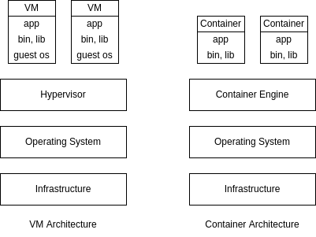

In this blog, I would cover my understanding of Docker.

# About Docker

- docker is a tool for managing containers
- container is a package of our code along with the dependencies and libraries to run that code
- docker follows a client server architecture
  - we issue commands via cli to the docker client
  - all tasks like creating containers, pulling images, etc. is done by docker daemon (dockerd)
- docker can be run natively in linux, so for macOS and windows, a virtualization layer is needed
- docker engine - dockerd, docker client
- docker desktop - docker engine, docker cli, kubernetes, docker compose, etc

# Why use Docker

- the same piece of code will always yield the same application i.e. doesn't rely on host environment
- having similar development, staging and production environments
- easily manage different projects running different versions of dependencies
- easily switch between versions of dependencies
- virtual machines are not as easily reproducible as containers since they have their own dedicated OS
- sharing and distributing is very convenient using Dockerfile, image, etc



# Images and Containers

- images are templates for containers, and a container is a running instance of an image
- containers are lightweight, isolated and run independent of each other
- we can use official prebuilt images, the most common source is [docker hub](https://hub.docker.com)
- note: while issuing docker commands
  - container name and container id can be used interchangeably, same for image
  - first few characters of the image_id are enough to reference the image if they can uniquely identify it
- `docker container run image_name` to create a container from an image
- if the image is not available locally, it is downloaded from dockerhub by docker
- `docker container ls` to list all running containers
  - `docker container ls -a` to list all running as well as stopped containers
- Dockerfile is a special file name, as it is the default file docker looks for when we build an image
- Dockerfile contains the instructions for creating our own image
- example of a Dockerfile
  ```Dockerfile
    FROM node:14-alpine
    WORKDIR /app
    COPY . .
    RUN npm install
    EXPOSE 80
    CMD npm run start
  ```
- all commands except the last instruction `CMD` are used to build the image, `CMD` is used to run the container
- `EXPOSE` is only for documentation purpose
- `docker image build .` - used to build an image using the Dockerfile, `.` here is the build context
  - `-t` flag to specify an image tag
- images have layers i.e. docker caches result after every instruction in the Dockerfile
- this means docker can reuse layers if possible
- so, to optimize i.e. make building of images faster, in the Dockerfile example shown earlier, we can first install dependencies and then copy the source code, as rebuilding of image will be triggered more frequently by a change in the source code than it will be by a change in the dependencies
  ```Dockerfile
  FROM node:14-alpine
  WORKDIR /app
  COPY package.json .
  RUN npm install
  COPY . .
  EXPOSE 80
  CMD npm run start
  ```
- `docker container start container_id` - start a stopped container
- we can reattach our terminal to the container using `docker container attach container_id`
- we can view logs using `docker container logs container_id`
  - add `-f` flag for following the logs
- flags for `docker container run` -
  - `-it` can be used to enter interactive mode
  - `--rm` flag to delete the container when we stop it
  - `--name` to specify name of container
  - `-d` to run in detached mode i.e. to not block our current terminal and run the container in foreground
  - `-p` flag means publish, i.e. map host port to a container port
- `docker image ls` - lists the downloaded images
- `docker image rm image_id` - remove the image with id image_id
- `docker container stop container_id` - stop the container
- `docker container prune` to delete all stopped containers
- to get more information on images and containers, use `docker container inspect container_id`  
  and `docker image inspect image_id`
- `docker container cp host_folder container_id:folder` to copy folder from the host to the container
  - we can also reverse the order of arguments to copy folders and files from the container to the host
- we can share images, by sharing the Dockerfile or by hosting it on an image registry like docker hub
- `docker image push image_name:tag` to push images to the registry
- `docker image pull image_name:tag` to pull images from the registry
- we can also tag images using `docker image tag new_image_name old_image_name`
- a full example of running a container - `docker container run -d -p 3000:80 --name=backend --rm backend`
- `docker login` to login to docker hub
- note: I had to use a token instead of the docker hub password since I am using MFA
- `docker image rm -f $(docker image ls -a -q)` - deletes all locally downloaded images
  - `-q` helps list only image ids
  - `-a` helps list intermediate images as well
  - `-f` force removal, e.g. if image is referenced by another image
- we can use a file `.dockerignore` to prevent copying files when using command `COPY` inside the Dockerfile e.g.
  ```
  node_modules
  Dockerfile
  .git
  ```

# Tags

- an image tag has two parts - the name / repository of the image and the tag
- tag is like a version, so we can generate different versions of our image
- the default tag if not specified is latest
- why tags are important -
  - rollback to previous versions in the production environment if newer versions have a bug
  - newer versions of other images which are used by our images might have breaking changes in future
- suppose we always push and pull using tag latest. when we run `docker container run...`, it looks for the image locally and if it doesn't find it, it goes online to fetch it. but it will find the image with the tag latest, and docker doesn't understand that someone else has pushed a newer version online

# Layered Architecture

- all the docker related data like images, containers, etc. can be seen in /var/lib/docker
- the doker image we build contains of layers, and these layers are shared across various images
- e.g. if two images use the same base image, the layer of the base image is shared
- the image layers are read only
- when we create a container, a new layer is created on top of the existing layers of the image
- thus, all writes that we perform during runtime, log files, etc. get written onto this layer
- the persistence during the container's lifetime happens through this writable layer
- this mechanism is called copy on write, and the changes we made are lost unless we use volumes

# Volumes

- containers should be stateless as they can be easily created and destroyed, scaled up and down
- we can have data that we want to persist even if containers are killed
- this data shouldn't be stored inside containers, or we may lose that data
- volumes - mapping a persistent storage to docker containers. the persistent storage can be cloud storage  
  e.g. s3 of aws or our host directory system
- this way, every time a container tries to persist changes, they go to the persistent storage and don't get lost irrespective of how many times the container is started or stopped
- volumes can be of three types -
  - anonymous volumes
  - named volumes
  - bind mounts
- `docker volume ls` shows all volumes
- anonymous volumes are managed by docker
- the **reference** to anonymous volumes are lost after the container shuts down
- if we use `--rm` flag while running the container, the anonymous volume is deleted as well
- we can create anonymous volume by using `VOLUME ./feedback` inside the Dockerfile
- we can also create anonymous volume by using flag `-v /a/b` during `docker container run` where /a/b is the path inside the container
- named volumes are managed by docker too
- unlike anonymous volumes, we don't lose the reference to named volumes after the container is deleted
- use flag `-v` to create named volumes, e.g. `-v feedback:/app/feedback`, where the name of the volume is feedback and the directory of the container it maps to is `/app/feedback`
- bind mounts are managed by us. it can be used for source code, so that the changes that we make to the code get reflected in the container
- in case of bind mounts, we have access to the folder which gets mapped to the container's folder
- in case of clashes, the more specific paths win e.g. if we are using bind mounts for /app of container and anonymous volumes for /app/node_modules of container, /app/node_modules relies on anonymous volumes
- using nodemon with bind mounts prevents us from rebuilding images repeatedly i.e. our changes in source code are accounted for in the running container
- we can use suffix `:ro` so that it specifies to the container that the volume is read only e.g. `-v $(pwd)/app:ro`, so that only hosts and not containers can edit the source code
- docker volume ls will not list bind mount volumes, since it doesn't manage them
- `docker volume rm volume_name` to remove volumes
- `docker volume prune` to remove volumes not being used by any containers
- `docker volume inspect volume_name` to get details of the volume

# Arguments and Environment Variables

- docker supports build time arguments and runtime environment variables
- runtime environment variables can be provided using `ENV PORT 80` inside the Dockerfile
- we can also provide it dynamically using `-e PORT=80`, which makes the earlier method a default
- for situations like api keys where security is a concern, the method suggested above is better
- we can also use build arguments, i.e. dynamic variables used when building an image
- can be done using `ARG PORT=80` in the Dockerfile

example -

```Dockerfile
ARG DEFAULT_PORT=80
ENV PORT $DEFAULT_PORT
EXPOSE $PORT
```

- we are giving the value of the build argument to the environment variable
- if we don't provide a port, the port used by container is `80`
- now, we can change the default port while building an image using `docker image build ... --build-arg DEFAULT_PORT=9999 ...`
- we can also receive a dynamic port using `docker container run ... -e PORT=9545 ...`
- if we don't provide a port dynamically, the port specified for building of image gets used

# Networks

- there are three kinds of entities with which containers can communicate -
  - internet
  - host
  - other containers
- containers can by default talk to the internet e.g. a public api
- for containers to talk to the host, we can replace localhost by `host.docker.internal`
- e.g. for containers to talk to mongodb running on our host machine, we can use `mongodb://host.docker.internal:27017/favorites`
- for containers to talk to other containers, we can use `docker container inspect ...` to get the container's ip address (available in the key IPAddress) and then use it. e.g. with a mongodb container running, we run `docker container inspect mongodb` and then use `mongodb://the_ip_address:27017/favorites`
- this is not ideal, as this IP could change after a new container replaces the old one
- we can create a docker network, and all containers placed inside the network can reference each other directly using the container names e.g. `mongodb://mongodb_container_name:27017/favorites`
- `docker network create network_name` to create a network
- `docker container run ... --network=network_name ...` to create a container inside a specific network
- also, we don't need `-p` for the container to which another container connects, i.e. `-p` is only needed when we want our host port to map to the container port, not when another container wants to communicate with it
- docker networks support different kinds of drivers. the default driver is bridge, which we saw above
- there can be other types of drivers and third party plugins for drivers as well
- we can use driver as "host" so that isolation between the container's network and localhost is removed
- examples of usage - `docker network create --driver bridge` or `docker container run --network host`
- we can clean up unused networks using `docker network prune`
- the bridge type of network uses [network namespaces](/the-tcp-ip-model/#network-namespaces) behind the scenes

# Docker Compose

- docker compose helps in preventing having to run docker commands from cli repeatedly
- it has syntax in yml which is easier to read and can be shipped with our code
- services in docker compose are containers, for which we can define environment variables, network, image, etc
- version of docker compose I had to use was 3.8 based on my [docker engine version](https://docs.docker.com/compose/compose-file/)
- all container names are one level nested under the services key
- can specify networks, volumes key for each container
- for named volumes, we should also mention them under the volumes key in the root of the file
- all the containers are a part of the default network created by docker-compose
- `docker-compose up` starts all the containers and builds the images as well
  - flag `-d` can be used to start in detached mode
  - add flag `--build` to force the images to be rebuilt
- `docker-compose down` - deletes all the containers and the default network that docker-compose creates
  - flag `-v` also removes the volumes which were created
- use `depends_on` key to ensure the order in which containers start e.g. server `depends_on` mongodb container
- `docker-compose build` to build the images
- `docker-compose run service_name` to run a specific container in the compose file under the services key

# Issues while Containerizing Frontend Apps

- docker doesn't work in the web browser for e.g. when we make xhr requests
  - so referring the backend application just by container name won't work as it utilizes docker networks
  - so, we publish the backend on a host port and simply use localhost:that_port in frontend
- reactJS needs the terminal to be in interactive mode to ensure it continues to run
  - it is like adding `-it` flag while using `docker container run...`, or setting `stdin_open: true` and `tty: true` inside of the docker compose

# CMD and ENTRYPOINT

- when we specify `docker container run image_name xyz`, xyz replaces what there is in CMD
- however xyz appends what is there in ENTRYPOINT
- we can replace what is there in ENTRYPOINT using `--entrypoint`

```Dockerfile
FROM ubuntu
ENTRYPOINT [ "sleep" ]
CMD [ "10" ]
```

- `docker image build -t ubuntu-sleeper .`
- run `docker container run ubuntu-sleeper`, sleep is of 10 seconds
- run `docker container run ubuntu-sleeper 20`, sleep is of 20 seconds
- run `docker container run -it --entrypoint=bash ubuntu-sleeper`, run bash in interactive mode

# Setup Containers

how do we set up initial project e.g. how to run `npm init` when we don't have node installed locally? below is an example for setup using node

Dockerfile.setup -

```Dockerfile
FROM node:14-alpine
WORKDIR /app
```

docker-compose-setup.yml -

```yml
version: "3.8"
services:
  npm:
    build:
      context: ./
      dockerfile: Dockerfile.setup
    stdin_open: true
    tty: true
    volumes:
      - ./:/app
    entrypoint: npm
```

now, we can use commands to help during development like -

- `docker-compose -f docker-compose-setup.yml run npm init`
- `docker-compose -f docker-compose-setup.yml run npm i express`

the `npm` in the command is the service name inside docker compose, and entrypoint was given as npm in docker-compose, otherwise we would have to run `docker-compose -f docker-compose-setup.yml run npm npm init`
