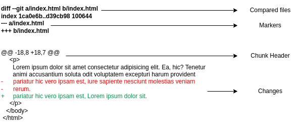

In this blog, I would cover my understanding of Git.

# About

- git is the most popular VCS (version control system)
- other VCSs include subversion, CVS, mercurial
- VCS helps track and manage changes and different versions of code
- how git was born - Linus Torvalds had a disagreement with BitKeeper, leading to the rise of open source git
- git stores files as a stream of snapshots i.e. it stores a snapshot of all files even if they did not change. if the file hasn't changed, it stores a reference to the previous version. this is contrary to other VCSs which do a delta based version control

# Basics

- git repository - a workspace which tracks all files and folders inside it
- `git status` - status of the current git repository
- `git init` - make the current directory a new git repository. this creates a .git folder in the current directory, which can be viewed using `ls -a`
- `rm -rf .git` - to remove git from tracking the current directory
- `git add` - stage changes i.e. move them to staging area, so that they can be committed. we can add selective files, or all files using `git add --all`
- two kinds of files can be added to staging area -
  - **modified** - we have told git about this file at some point earlier, and they have been modified
  - **untracked** - git doesn't know about this file
- `git commit` - opens the default editor where we can provide a summary for the staged changes
- `git commit --amend` can be used to move changes in the current staging area to the previous commit and then retype the commit message. this would change the commit hash, which is not ideal for work which other collaborators may have
- `git log` - display all commits and information associated with them
- `git log --oneline` can be used, which is a shorthand for `git log --pretty=oneline --abbrev-commit`
- `git log --oneline --graph` can be used, helps show connection between commits
- commit best practices -
  - atomic commits - each commit should be focussed on a single thing
  - language of commits - present tense and imperative i.e. giving a command e.g. `add .gitignore`
- `.gitignore` - a file where we specify files and folders to ignore. this helps in ignoring files like operating system files, secret keys, log files and dependencies. we can find .gitignore starters online if we know the type of application we are working on

# Branches

- creating branches helps work on independent features
- branches don't affect what's happening to the other branches
- by default `master` is the branch which is created, but otherwise master is in no way special
- as a best practice, the master branch is treated as the source of truth, the production branch, and new features are tried and tested first on other branches before merging them with the master branch
- `HEAD` points to the branch's tip that we are on
- `git branch` - view all branches
- `git branch new_branch` - create the branch new_branch. history of new_branch is the same as the branch from which we ran the command
- `git switch new_branch` - switch to the branch new_branch
- sometimes changes in the current branch need to be stashed or committed else we won't be able to switch to the new branch
- `git branch -d new_branch` to delete the branch new_branch. we might have to replace `-d` with `-D` if the changes have not been merged yet
- `git branch -m new_branch` to rename the current branch to new_branch
- `cat .git/HEAD` shows what the HEAD points to e.g. `ref: refs/heads/master`
- `cat .git/refs/heads/master` shows the commit hash the branch's tip points to

# Merging

- merging helps in combining changes of different branches
- let the branch in which we want the changes be called receiving branch
- run `git merge new_branch` from receiving branch
- merges can be of two types - **fast-forward merge** and **three-way merge**
- fast-forward merge - new_branch just has a few commits on top of the receiving branch i.e. receiving branch has not changed since new_branch was created and modified. in this case, only the new commits can be copied to the receiving branch
- three-way merge - new_branch has a few commits as well as the receiving branch has a few commits since new_branch was created. a new commit, whose parents are the tips of the two branches is created
- to avoid issues, we should stash uncommitted changes in the current branch before merging changes from other (including remote) branches

# Merge Conflicts

- happens when the same lines have been edited in the two branches
- we should resolve the conflict according to need and then simply add and then commit the changes
- so it ends up being a three-way merge ultimately

what a conflict looks like -

```
<<<<<< HEAD
receiving branch changes here
===========
new_branch changes here
>>>>>> new_branch
```

# Diff Commands

- `git diff` - only changes that have not been staged
- `git diff --staged` - only changes that have been staged
- `git diff HEAD` - both changes that have and have not been staged
- `git diff branch_1..branch_2` - changes between the two branches
- `git diff commit_hash_1..commit_hash_2` - changes between the two commits
- we can specify a `filename` to output changes only for that file, e.g. `git diff --staged file.txt`

# Diff Output

the output of `git diff` has been explained below i.e. how to read the output



- compared files - old file is called a/index.html, new file is called b/index.html
- markers - a/index.html will get `-`, b/index.html will get `+`
- chunk header - 8 lines, from line 18 for a/index.html and 7 lines, from line 18 for b/index.html have been shown
- changes - changes in the file following the conventions above

# Stashing

- when we try to switch to another branch with changes in the current branch, one of two things can happen -
  - changes of the current branch do not conflict with the branch we are trying to change to
    - in this case, we will be allowed to switch and changes will be carried on to the branch we changed to
  - changes of the current branch conflict with the branch we are trying to change to
    - in this case, we won't be allowed to switch
- stashing helps keep changes in a temporary place, and work on something else so that the new changes don't affect the changes in the temporary area
- `git stash list` - show all the elements in stash
- `git stash save msg` - save changes, both staged and not staged, with message msg
- `git stash apply stash_id` - apply the stashed changes at stash_id. this doesn't remove it from the stash
- `git stash drop stash_id` - remove the stashed changes at stash_id from the stash
- `git stash clear` - clear the entire stash

# Checkout

- git checkout does a lot of things like discarding changes, creating and switching branches but the following is the only scenario where I plan to use it
- `git checkout commit_hash` - helps us go back to a commit
- `cat .git/HEAD` will show the commit hash now
- this state is called detached head as HEAD usually points to a branch, but here it points to a commit
- we can spawn off a new branch from this point to make more changes
- we can go back to the normal state where the HEAD points to a branch using `git switch branch_name`

# Referencing Commits

- whenever commit hashes are required as input in git commands in general, first few characters of commit hashes are enough
- `HEAD~1` refers to the parent commit of HEAD, `HEAD~2` refers to the grandparent commit and so on, so whenever a git command expects commit hashes, we can use this to refer to commits relative to HEAD
- also, `branch_name~3`, same for tags, etc. are allowed

# Restore

- `git restore file_name` - discard changes that were not staged
- `git restore --staged file_name` - make changes go from staging area to modified area
- `git restore --source commit_hash file_name` - make file_name go back to its state at commit_hash

# Reset

- `git reset commit_hash` - make the repository go back to the commit `commit_hash`, it doesn't discard the changes, but it does discard the commits
- `git reset --hard commit_hash` - make the repository go back to commit_hash by discarding the changes
- `reset` affects history which others collaborating with us may have, which is never good

# Revert

`git revert commit_hash` helps remove the changes that were brought in by commit_hash by making a new commit on top. this is better than reset as this won't affect the old history

# Working with Remote Repositories

- helps in pushing local changes to an online hosted repository
- apart from serving as a backup for local code, this also helps in collaborating with others
- `git clone url` works irrespective of whether we have an account in github, if repository is public
- we can also create a repository on github
- `git remote -v` - shows the remote repositories our local git repository is linked to
- `git remote add name url` - asking git to remember an url using name, where name is commonly origin
- `git remote add ...` is not needed when we clone, as git already "knows" about the url in that case
- remote tracking branches - `origin/branch_name` refers to the origin's branch_name, in other words, the last information that our local git repo has about a branch of the remote repository
- `git branch --all` - helps see both remote and local branches
- when we clone, only the default branch is connected to default remote branch
- for other branches, we don't get the local branches, just the remote tracking branches e.g. we only get origin/branch_name, not branch_name
- in such cases, simply running `git switch branch_name` will
  - create the local branch `branch_name`
  - set it to track the remote branch origin/branch_name
- `git fetch` - download changes from the remote repository to the remote tracking branches
- `git fetch -p` - will also help delete references to the remote branches which no longer exist on remote e.g. a feature branch which was deleted after being merged into master
- we can simply run `git merge origin/branch_name` after the command before, to merge changes of the remote tracking branches to the local branch
- note: merge conflicts can happen here as well, simply resolved like a normal conflict
- `git branch -u origin/main` - current local branch tracks the remote branch main, so we can just use `git push` from the current branch

# Rebase

- rebase can be used as an alternative to merging
- when we rebase, we rewrite history
- usually, we rebase our feature branch on top of the master branch
- this helps in keeping a linear git history, preventing merge commits
- it does this by rewriting each of our feature branch commits on top of the last commit from master
- note: we should never rebase commits which others have, as rebasing changes commit hashes
- `git rebase main` to rebase changes in current branch on top of the branch main
- in case of a conflict during rebase, follow these steps -
  1. resolve the conflict, which changes our code just like merge conflict
  2. run `git add --all`
  3. run `git rebase --continue`

# Interactive Rebase

- change git history easily like a cleanup tool, to squash, reword commits etc
- `git rebase -i commit_hash` - helps us modify commits from the latest commit to commit_hash
- note: commits are displayed old to new, unlike output of `git log`, which shows commits new to old

# Cherry Picking

- by cherry-picking in the current branch, you can choose what commits you want
- `git cherry-pick commit_hash` - add changes due to commit_hash on top of current branch. this would result in a new commit with a hash different from commit_hash
- we can also specify ranges in cherry-picking, e.g. `git cherry-pick commit_hash_old..commit_hash_new` or something like `git cherry-pick branch_name~3..branch_name`
- use case - we can selectively include changes from different feature branches which are ready for release

# Tags

- label commits to mark versions, releases of projects
- we can handle tags using gui online, we can also disable deleting of tags there
- two types of tags -
  - lightweight tags - just contains the name of the tag
  - annotated tags - contains more metadata, so they are preferred
- semantic versioning e.g. `v18.2.3` has three chunks - major release, minor release, patch release
  - major release - for breaking changes
  - minor release - for newer functionality, however still retains backward compatibility
  - patch release - for minor bug fixes
- `git tag` helps view all tags
- we can use the tags assigned to a commit to go back to old commits using checkout, compare commits using diff, etc. e.g. instead of `git diff commit_hash_1 commit_hash_2`, we can use `git diff tag_1 tag_2`
- `git tag v18.2.3` - to create a lightweight tag
- `git tag -a v18.2.3` - to create an annotated tag
- `git show v18.2.3` - to show details about the tag
- `git tag v18.2.3 commit_hash` - to create a lightweight tag on an older commit
- `git tag v18.2.3 commit_hash -f` - to move an existing tag to a new commit
- `git tag -d v18.2.3` - to delete a tag
- `git push --tags` - push the tags to the remote repository

# Hooks

- run executable scripts before or after specific git events
- hooks are processes, so if they return 0, they are considered to have run successfully
- for some hooks return code need not matter e.g. post commit hook
- use cases -
  - verify commit message format before commit
  - run tests before commit or push
  - run linter before commit or push
- by default, git has hooks in .git/hooks with extension .sample to prevent them from running
- remember to run `chmod +x` on the hook for it to be able to execute
- these hooks are not pushed to the remote repository, which means inconsistencies for collaborators
- so, instead of doing it using simply git hooks, we should use libraries like -
  - husky - allows hooks to be shared with collaborators
  - commitlint - validating commit messages
  - commitizen - cli to help writing commit messages
