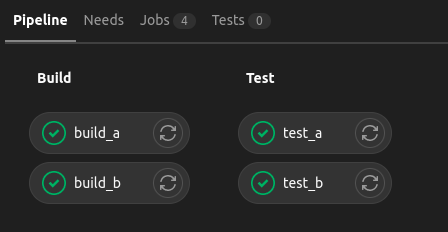
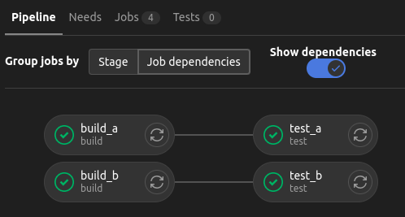
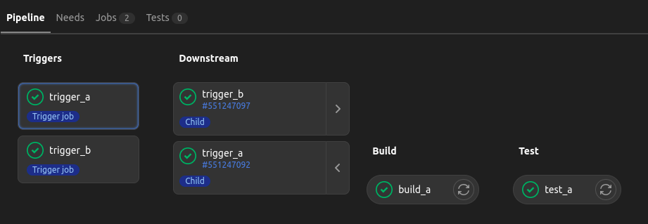

In this blog, I would cover my understanding of CI/CD in Gitlab.

# CI/CD

- **continuous integration** - code gets tested and built every time we push to get continuous feedback
- **continuous delivery** - some manual intervention is needed to install it into servers
- **continuous deployment** - a step beyond continuous delivery, using which we deploy to servers automatically
- building, unit and integration tests come under ci and reviews, deployment to staging and production under cd

# Architecture

- pipelines are written in .gitlab-ci.yml unless configured otherwise
- gitlab runner is the tool used by gitlab to run the pipeline
- gitlab servers schedule the pipelines on gitlab runners
- this architecture allows for the horizontal scaling of runners
- by default, shared runners available for the saas version of gitlab, [with a limit of 400 minutes a month](https://about.gitlab.com/pricing/)
- we can use tags to run a job on a specific type of runner, e.g. some job needs to be run on a windows os
- any runner with all the job tags is eligible to run that specific job
  ```yml
  job-name:
    tags:
      - ruby
      - test
  ```
- executors - the way the jobs are run by the runner. some of them are - 
  - shell - run on the vm itself
  - docker - run inside a docker container
  - kubernetes - run as a pod in a k8s cluster

# Jobs and Stages

- jobs are the unit of work in gitlab pipelines
- the order to execute the different jobs in can be defined via stages
- stages run in a sequential order
- jobs in the same stage run in parallel
- jobs of stage x + 1 start executing only when all jobs of stage x are over and successful by default
- we can retry a job / pipeline if it fails, using the retry icon in ui

# Image

- gitlab uses docker to execute pipelines
- by default, gitlab pipelines use the image ruby:2.5
- we can set a default image at the yml root so that unless specified otherwise, all jobs use this image
- syntax - `image: node:16-alpine`
- gitlab has its own container registry, which is an alternative to docker hub, ecr, etc
- using gitlab's container registry reduces network latency
- gitlab also has its own package repository for maven, npm, etc

# Methods of Triggering a Pipeline

- a push to the codebase
- we can also manually trigger a pipeline run by clicking on "run pipeline" under ci/cd -> pipelines. we get a chance to override the variables if we want for that particular run
- we can have scheduled pipelines, e.g. perform health check on production website every 2 hours
- we can trigger them via upstream pipelines i.e. a pipeline triggers another pipeline
  ```yml
  job:
    stage: test
    trigger: group/project
  ```
- by making api calls to gitlab

# Using Command Line

- if a command returns 0, gitlab considers the command to have passed
- if a command returns 1-255, it is considered to have failed, which in turn marks the job as failed
- `echo $?` can display the return code by the last command
- pipe operator can be used to pipe output of cmd1 to cmd2 - `cmd1 | cmd2`
- some commands run perennially e.g. `npm run serve`, which can block the command line of the job
  - suffix with `&`, e.g. `npm run serve &` to run it in background
  - add a sleep e.g. `sleep 5` to allow for the server to have started properly
  - [why `tac` was needed](https://stackoverflow.com/a/28879552/11885333)
    ```yml
    script:
      - npm run serve &
      - sleep 5
      - curl http://localhost:9000 | tac | tac | grep -q "Gatsby"
    ```
- sed is used to replace strings in templates. e.g. to replace `%%VERSION%%` from html footer, use `sed -i "s/%%VERSION%%/$CI_COMMIT_SHORT_SHA/" ./index.html`
- `jq` is used for json related parsing in command line
- we also have `before_script` and `after_script`, which can be defined at global / job level. it is just for semantic purpose and refactoring code

# Artifacts

- the jobs run independent of one another, so to share data between them, we use artifacts
- we can view / download the artifacts from the pipeline runs
- we can configure as to when the artifacts should be expired

```yml
build:
  # ...
  artifacts:
    paths:
      - public/
    expire_in: 1 day
```

# Cache

- since jobs run isolated, we can cache for e.g. external project dependencies
- we specify a key for the cache and the path to cache
- key can be files as well e.g. package-lock.json
- we can specify this at the root level as well
- gitlab jobs will have logs like `failed to extract cache`, `successfully extracted cache`, etc
  ```yml
  cache:
    key:
      files:
        - package-lock.json
    paths:
      - node_modules
  ```
- there are more considerations like for e.g. where does the cache go. we can have the cache go to the runner itself and not the server or some other place to optimize latency. for this, we might have to use tags to ensure that the jobs get picked up by the same runner
- we can use one runner and the cache is stored in that runner
- we can also use multiple runners with distributed caching e.g. s3

# Environment Variables

### Custom

- settings -> ci/cd -> variables
- these are environment variables available to jobs
- we can mask them, which means gitlab will try hiding them from job logs
- we can protect them, which means these variables would only be available to protected branches and tags

### Predefined

- predefined variables accessible in jobs have been listed [here](https://docs.gitlab.com/ee/ci/variables/predefined_variables.html)
- a common use case - tag docker images which are being built and pushed with commit hash

### In Pipelines

we can use the `variables` key - either at the pipeline or at the job level to define variables

```yml
variables:
  IMAGE_REPOSITORY: $ECR_REPOSITORY:$CI_COMMIT_HASH
```

# Environments

- we can add environments to the job
- it adds stuff to the gitlab ui like merge requests
- from the sidebar, deployments -> environments

```yml
deploy staging:
  # ...
  environment:
    name: staging
    url: $STAGING_DOMAIN
```

# Gitlab Configuration

- uncheck this option - settings -> ci/cd -> general pipelines -> public pipelines
- switch this to only project members - settings -> general -> visibility, project features, permissions -> ci/cd
- check this option - settings -> general -> merge requests -> merge checks -> pipelines must succeed
- i like to have a stable production and staging enviornment, so i configure the following in settings -> repository -> protected branches - 
  - maintainers can push (even force push) and merge to staging - rationale was to allow removing commits which are not ready for production, which was realized after testing in the staging environment
  - no one can push to main and maintainers can merge to main
- i use rebase, so i select fast-forward merge from settings -> general -> merge requests

# Manual Triggering

- we can have a manual play button to run a job which continues the pipeline
- use case - continuous deployment
- the job `b` would be stalled while jobs of future stages continue to run -
  ```yml
  b:
    stage: b
    when: manual
  ```
  the "fix", depending on the behavior we want, is to use `allow_failure`
  ```yml
  b:
    stage: b
    when: manual
    allow_failure: false
  ```
- using the newer `rules` method, it would behave like the second configuration above
  ```yml
  rules:
    - when: manual
  ```

# YAML Anchors

- `& anchor_name` is used for anchor source
- for examples below, use [any tool](https://onlineyamltools.com/convert-yaml-to-json) to see equivalent json
- `just *anchor_name` is used to use the anchor as is
  ```yml
  person:
    first_name: &name john
    last_name: doe
    id: *name
  ```
- `<<: *anchor_name` is used for destructuring anchor. merging nested properties and overriding them is allowed
  ```yml
  person_one: &doe_twins
    first_name: john
    last_name: doe
    age: 14

  person_two:
    <<: *doe_twins
    first_name: jane
  ```

# Reusing Job Configuration

- we can use gitlab's pipeline editor. from the sidebar on right, we can navigate to ci/cd -> editor. we can copy our pipeline files to the editor for linting and visualizing them
- e.g. using yml anchors for reusing job config - 
  ```yml
  .deploy-template: &deploy
    script:
      - npm install --global surge
      - surge --project ./public --domain $DOMAIN
    environment:
      url: $DOMAIN

  deploy staging:
    stage: deploy staging
    <<: *deploy
    variables:
      DOMAIN: $STAGING_DOMAIN

  deploy production:
    stage: deploy production
    <<: *deploy
    variables:
      DOMAIN: $PRODUCTION_DOMAIN
    rules:
      - when: manual
  ```
- when we prefix a job with `.` it is ignored by gitlab pipelines
- so, another way is to use the `extends` keyword. refactoring the above example - 
  ```yml
  .deploy:
    script:
      - npm install --global surge
      - surge --project ./public --domain $DOMAIN
  # ...
  deploy staging:
    extends: .deploy
    stage: deploy staging
  # ...
  ```

# Templates

- we can use built in templates in our pipelines, e.g. [auto devops](https://docs.gitlab.com/ee/topics/autodevops/) includes features like container scanning, vulnerabilities, license issues, etc
  ```yml
  include:
    - template: Auto-Devops.gitlab-ci.yml
  ```
- to use a yml file from the project itself e.g. - microservices with monorepo, we can use - 
  ```yml
  include:
    - local: .gitlab-ci.common.yml
  ```

# Services

- we can run services e.g. a postgres in the background for running tests. e.g.
  ```yml
  services:
    - tutum/wordpress:latest
  ```
- the service can be accessed under two host names - `tutum__wordpress` and `tutum-wordpress`
- we can [configure](https://docs.gitlab.com/ee/ci/services/#available-settings-for-services) `name`, `alias`, `command`, `entrypoint` and `variables` for each service

# Conditionally Running Jobs

- pipelines can be triggered on different events like new commits, new tags, merge requests, etc
- `only` and `except` are predecessors of `rules`
- e.g. below of triggering a job on all branches except main
  ```yml
  only:
    - branches
  except:
    - main
  ```
- the same thing written using rules - 
  ```yml
  rules:
    - if: $CI_COMMIT_BRANCH == 'main'
      when: never
    - when: always
  ```
- we can run a job only when changes are there in a specific directory
  ```yml
  rules:
    - changes:
        - Dockerfile
  ```
- we should address inefficient cases like 2 pipelines are created on creating a merge request
- operators operate on variables, like `==`, `=~` for regexp, etc
- in a rule, we set `allow_failure: true` so that the pipeline would pass even if the job fails
- the different values when can take - `manual`, `never`, `always`, `on_success` (when all jobs from all prior stages pass), `on_failure` (when one job from any prior stage fails), `delayed` (run after time set in `start_in`)
- summing up the syntax - 
  ```yml
  rules:
    - if: $CI_COMMIT_BRANCH =~ /^(staging|main)$/
      when: delayed
      allow_failure: true
      start_in: 5 seconds
  ```
- whatever is inside `when` will only count if the `if` of a rule evaluates to true
- defaults are `when: on_success` and `allow_failure: false`
- we can have a catch all logic, e.g. `when: always` as the last rule

# Pipelines

the different types of pipelines are - 

- basic pipelines
- dag (directed acyclic graph) pipelines
- multi project pipelines
- parent child pipelines
- pipelines for merge requests
- pipelines for merge results (premium only)
- merge trains (premium only)

### DAG Pipelines

- dag - direct acyclic graph
- by default, jobs in stage x + 1 do not start executing unless all jobs in stage x are complete
- we might need to speed up our pipelines, since it might happen that all jobs of stage x + 1 do not need all jobs of stage x to finish successfully. e.g. `test_a` is having to wait for `build_b` even though it does not depend on it
  ```yml
  stages:
    - build
    - test

  .common:
    script:
      - echo "ran job $CI_JOB_NAME successfully"

  build_a:
    extends: .common
    stage: build

  build_b:
    extends: .common
    stage: build
    before_script:
      - sleep 10

  test_a:
    extends: .common
    stage: test

  test_b:
    extends: .common
    stage: test
  ```
- we use the `needs` keyword in this case. optimized code - 
  ```yml
  test_a:
    # ...
    needs:
      - build_a

  test_b:
    # ...
    needs:
      - build_b
  ```

a comparison of with vs without dag pipeline

<div class="blog--divider">

  <div class="blog--left">
  
  
  
  </div>

  <div class="blog--right">
  
  
  
  </div>

</div>

### Parent Child Pipelines

- parent pipeline triggers child pipelines
- note: a job should either have a script or a trigger
- used for separation of concern, e.g. monorepo with microservices
- using `strategy: depend`, the job will mirror the status of the target pipeline, otherwise it goes green immediately after triggering the target pipeline and continues with the source pipeline
- such jobs which trigger other pipelines are called bridge jobs
- for now, i like to think that multi project pipeline works in the same way as parent child pipelines, with the exception that instead of `include`, we use the `project` key under `trigger`
- variables set in the source pipeline are passed to the child pipeline

```yml
stages:
  - triggers

trigger_a:
  stage: triggers
  trigger:
    include: a/.gitlab-ci.yml
    strategy: depend
  rules:
    - changes:
        - a/*

trigger_b:
  stage: triggers
  trigger:
    include: b/.gitlab-ci.yml
    strategy: depend
  rules:
    - changes:
        - b/*
```

only one can be expanded at a time in ui - 



### Merge Pipelines

- merge request pipeline runs on the source branch ignoring the target branch
- merge result pipeline runs on the result of merging the source branch with the target branch
- merge trains run on the result of multiple merges
  - e.g. first feature/one created an mr to main and then feature/two created an mr to main
  - the first pipeline will run on the merge_result(feature/one, main)
  - the second pipeline will run on the merge_result(feature/two, merge_result(feature/one, main))
- my understanding - in gitlab premium, we get options in settings -> general -> merge requests depending on when we want to run the merge pipeline. otherwise it is a merge request pipeline by default since the other two are gitlab premium features. syntax for all three in the pipeline file is the same
- old `only` syntax - 
  ```yml
  only:
    - merge_requests
  ```
- new `rules` syntax - 
  ```yml
  rules:
    - if: $CI_PIPELINE_SOURCE == 'merge_request_event'
  ```

# Workflow

- we can specify the rules at the pipeline level instead of specifying on the job level, e.g. -
  ```yml
  workflow:
    rules:
      - if: $CI_COMMIT_TAG
      - if: $CI_COMMIT_BRANCH
  ```
- we can use [this](https://gitlab.com/gitlab-org/gitlab/-/tree/master/lib/gitlab/ci/templates/Workflows) for common scenarios to prevent issues like duplicate pipelines
  ```yml
  include:
    - template: 'Workflows/Branch-Pipelines.gitlab-ci.yml'
  ```

# Docker in Docker

- we might have a use case like docker pushing to the container registry
- docker in docker or dind helps run docker commands from inside containers
- the container the job runs commands on has the docker client
- we run the docker daemon as a service

```yml
  image: docker:20.10.16
  services:
    - docker:20.10.16-dind
```
