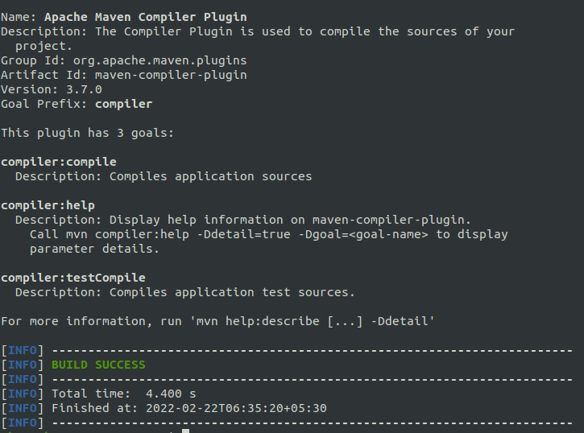
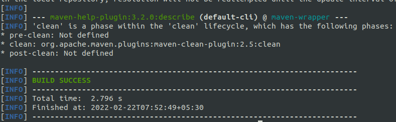
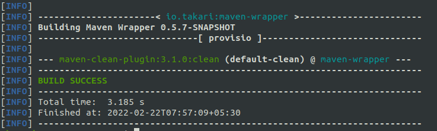
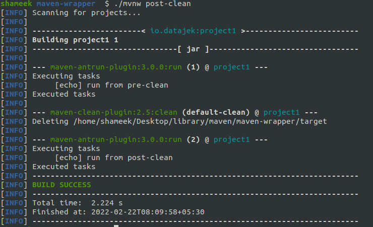

In this blog, I would cover my understanding of Maven.

# Concepts

- build - process of converting source code files to standalone executables that can be run
- build tool - maven is a build tool as it addresses issue related to building and makes the process easier
- artifact - objects produced, can be design documents or released executables
- build automation - automating the compiling, packaging and testing of software

# Plugins

- maven core itself is very small
- plugins are pieces of code to perform various steps of the build process e.g. **compiler plugin** to compile code, **jar plugin** to create jars, **surefire plugin** to run unit tests

# Goal

- maven plugins consist of goals, and goals are a unit of work
- maven compiler plugin has three goals, `compiler:compile`, `compiler:help`, `compiler:testCompile`

output of `./mvnw help:describe -Dplugin=org.apache.maven.plugins:maven-compiler-plugin` -



# Coordinates

- maven coordinates help identify a project uniquely
- it consists of **group id** (name of the company, convention is to use company's domain name in reverse), **artifact id** (unique name for the project inside the company) and version
- we can specify two more fields, which don't participate in defining the project uniquely - **classifier** (e.g. jdk8 or jdk11, to signify different artifacts built from the same pom) and **packaging** (jar to produce a jar archive, war to produce a web application to be run on a server like tomcat)
- coordinates are expressed as `io.company:feedback-service:jar:1.0-SNAPSHOT`
- in the pom -
  ```xml
  <groupId>io.company</groupId>
  <artifactId>feedback-service</artifactId>
  <version>1.0-SNAPSHOT</version>
  ```

# Repository

- local repository - local cache for artifacts and dependencies, found in `~/.m2/repository` on my machine. maven first looks in the local repository before looking elsewhere
- remote repository - set to the [maven central repository](https://repo1.maven.org/maven2/) by default, companies with compliance can have their own remote repository, which can again be a mirror of the maven central repository
- packages are generally found at `<groupId>/<artifactId>/<version>/<artifactId>-<version>.<packaging>`, both for remote and local repositories
- maven basically adds these to the classpath when we run stuff, that is how importing libraries works in maven. this might not always be the case, we can also have a fat jar, also called uber jar 

# Lifecycle

- build lifecycle - a set of build phases
- build phases - build phases have plugin goals attached to them
- e.g. maven `clean` lifecycle has three phases - `pre-clean`, `clean` and `post-clean`
- when we run a phase, the phases before it in the lifecycle run as well e.g. when we run `./mvnw clean`, `pre-clean` would run as well, when we run `./mvnw post-clean`, all three phases will be run and so on
- however, a phase with no goals bound to it is not run. pre-clean and post-clean have no goals bound to them, so they are not run by default
- maven has three built in lifecycles - `clean`, `default`, `site`

output of `./mvnw help:describe -Dcmd=clean` -



output of `./mvnw clean` -



# Default Lifecycle When Packaging is Jar

plugin goals bound to the build phases of the default lifecycle change based on the packaging type

<div class="table-wrapper">

| phase                  | plugin:goal             |
|------------------------|-------------------------|
| process-resources      | resources:resources     |
| compile                | compiler:compile        |
| process-test-resources | resources:testResources |
| test-compile           | compiler:testCompile    |
| test                   | surefire:test           |
| package                | jar:jar                 |
| install                | install:install         |
| deploy                 | deploy:deploy           |

</div>

# Attaching Goals to Phases

we attach the `run` goal of `maven-antrun-plugin` to `pre-clean` and `post-clean` phases

```xml
<build>
  <plugins>
    <plugin>
      <groupId>org.apache.maven.plugins</groupId>
      <artifactId>maven-antrun-plugin</artifactId>
      <version>3.0.0</version>
      <executions>
        <execution>
          <id>1</id>
          <phase>pre-clean</phase>
          <goals>
            <goal>run</goal>
          </goals>
          <configuration>
            <target>
              <echo level="info">run from pre-clean</echo>
            </target>
          </configuration>
        </execution>

        <execution>
          <id>2</id>
          <phase>post-clean</phase>
          <goals>
            <goal>run</goal>
          </goals>
          <configuration>
            <target>
              <echo level="info">run from post-clean</echo>
            </target>
          </configuration>
        </execution>

      </executions>
    </plugin>
  </plugins>
</build>
```

output of `./mvnw post-clean` -



# POM

- a pom (project object model) file describes the project configuration like dependencies, plugins, etc
- the elements we can place inside the xml file is governed by xsd (xml schema definition), the version of which is defined by `<modelVersion>`. the xsd can be found [here](https://maven.apache.org/xsd/maven-4.0.0.xsd)
- minimum version of the pom file -
  ```xml
  <?xml version="1.0" encoding="UTF-8"?>
  <project>
    <modelVersion>4.0.0</modelVersion>
    <groupId>io.maven</groupId>
    <artifactId>empty-project</artifactId>
    <version>1</version>
  </project>
  ```
- all pom implicitly inherit from the **super pom**, which can be viewed [here](https://maven.apache.org/ref/3.6.3/maven-model-builder/super-pom.html). if a pom has a chain of parent poms, the last parent pom will then inherit from the super pom
- we can use `./mvnw help:effective-pom` to view the final pom that maven uses to build the project

# Parent POM Example

- this uses the concept of **inheritance**
- we can have multiple children with all very similar configuration. instead of providing this configuration repeatedly, we can provide it at the parent level from which all children can inherit
- assume we have two folders, parent and child _which are siblings_
- note how for parent, packaging type is pom
- so, we may have to run `./mvnw install` first for the parent, so that it gets downloaded in the ~/.m2 folder, then run `./mvnw install` for the child
- to prevent having to do this repeatedly, the `relativePath` element was added, so now we only need to run `./mvnw install` for child/pom.xml
- we can also remove the version tag from the child, the parent version gets inherited in this case

parent/pom.xml

```xml
<?xml version="1.0" encoding="UTF-8"?>

<project>
  <modelVersion>4.0.0</modelVersion>

  <groupId>com.learn-maven</groupId>
  <artifactId>parent</artifactId>
  <version>1</version>

  <packaging>pom</packaging>
  <name>parent</name>
</project>
```

child/pom.xml

```xml
<?xml version="1.0" encoding="UTF-8"?>

<project>
  <modelVersion>4.0.0</modelVersion>

  <parent>
    <groupId>com.learn-maven</groupId>
    <artifactId>parent</artifactId>
    <version>1</version>
    <relativePath>../parent/pom.xml</relativePath>
  </parent>

  <groupId>com.learn-maven</groupId>
  <artifactId>child</artifactId>
  <version>1</version>

  <packaging>jar</packaging>
  <name>child</name>
</project>
```

# Aggregator POM Example

- this uses the concept of **multi module**
- the parent references the child, so it is called an aggregator
- the parent is aware of all its children, and if a maven command is run on the parent, it executes against all the children as well
- the pom can be both a parent and aggregator at the same time
- maven uses **reactor**. it helps sort the multiple modules in the correct order in which they should be built, without the user having to specify this order
- `<module></module>` has the path of the child directory

parent/pom.xml

```xml
<?xml version="1.0" encoding="UTF-8"?>

<project>
  <modelVersion>4.0.0</modelVersion>

  <groupId>com.learn-maven</groupId>
  <artifactId>parent</artifactId>
  <version>2.3</version>

  <packaging>pom</packaging>
  <name>parent</name>

  <modules>
    <module>child</module>
  </modules>

</project>
```

parent/child/pom.xml

```xml
<?xml version="1.0" encoding="UTF-8"?>

<project>
  <modelVersion>4.0.0</modelVersion>

  <parent>
    <groupId>com.learn-maven</groupId>
    <artifactId>parent</artifactId>
    <version>2.3</version>
    <relativePath>../pom.xml</relativePath>
  </parent>

  <groupId>com.learn-maven</groupId>
  <artifactId>child</artifactId>

  <packaging>jar</packaging>
  <name>child</name>
</project>
```

# Variables

we can access variables from various sources to use in the pom file -

- java system properties - values returned by snippet `java.lang.System.getProperties()`. usage: `${java.home}`
- elements in settings.xml - usage: `${settings.offline}`
- elements in environment variables - usage: `${env.PATH}`
- any element in the xsd - usage: `${project.packaging}`
- elements in the properties block can be referenced directly - `${MyName}`

example -

```xml
...
<properties>
  <MyName>Jack</MyName>
</properties>
...
<version>${project.artifactId}-${java.home}-${env.USER}-${MyName}-${settings.offline}</version>
...
```

# Versions

- version of a project is of the form `<majorVersion>.<minorVersion>.<incrementalVersion>-<qualifier>`
- while specifying dependencies, we can use ranges e.g. `<version>[1.2, 2.0)</version>` i.e. version 1.2 or above but less than 2. `[` is inclusive while `(` is exclusive
- if qualifier is `SNAPSHOT`, the repository is fetched everytime from maven, even if it is present locally. e.g. for a project that is under active development, it cannot be released regularly, so it releases using the snapshot qualifier. internally, maven suffixes with timestamps (which can be seen in ~/.m2/repository) to manage them

# Dependency

- if our project depends on jar-x, jar-x on jar-y and jar-y on jar-z, maven will download all three jars, jar-x, jar-y, jar-z for us. jar-x is called a direct dependency while jar-y and jar-z are called transitive dependencies
- `mvn dependency:tree -Dverbose` can be used to print the dependency tree
- maven handles dependency version related conflicts too
- deciding what version of a dependency to use when multiple versions of a dependency are encountered is called **dependency mediation**
  - imagine project &#10132; jar-a &#10132; jar-c:1.2 and project &#10132; jar-b &#10132; jar-c:2.2. in the pom of our project, if we mention jar-a first, jar-c:1.2 is used, otherwise if we mention jar-b first, jar-c:2.2 is used
  - imagine project &#10132; jar-a &#10132; jar-c &#10132; jar-d:1.2 and project &#10132; jar-b &#10132; jar-d:2.2. in this case, jar-d:2.2 is used
- using `<exclusion>` tag, we can exclude transitive dependencies
  ```xml
  <dependency>
    <groupId>io.learn-maven</groupId>
    <artifactId>jar-a</artifactId>
    <version>1</version>
    <exclusions>
      <exclusion>
        <groupId>io.learn-maven</groupId>
        <artifactId>jar-b</artifactId>
      </exclusion>
    </exclusions>
  </dependency>
  ```
- we can mark a dependency in our project as optional, this way if any project uses our project, the dependency we marked as optional doesn't come in as a transitive dependency
  ```xml
  <dependency>
    <groupId>org.projectlombok</groupId>
    <artifactId>lombok</artifactId>
    <optional>true</optional>
  </dependency>
  ```
- we can use [maven enforcer plugin](https://maven.apache.org/enforcer/maven-enforcer-plugin/) to establish constraints, e.g. specify the version of a dependency to use explicitly if, for instance, it is a transitive dependency coming from multiple sources

# Dependency Scope

- scopes help modify the classpath based on the build task
- the scope of a dependency also affects the scope of its transitive dependencies
- difference between system and provided - dependency with scope `system` also has an element `<systemPath>` which it uses to look for the dependency
- a new scope, **import**, applicable to dependencies with packaging `pom`, means that the dependency should be replaced with its `<dependencyManagement>` section

<div class="table-wrapper">

| Scope    | Compile  | Test     | Runtime  |
|----------|----------|----------|----------|
| compile  | &#10004; | &#10004; | &#10004; |
| test     |          | &#10004; |          |
| runtime  |          | &#10004; | &#10004; |
| provided | &#10004; | &#10004; |          |
| system   | &#10004; | &#10004; |          |

</div>

# Dependency Management

- note: all dependencies of the parent in the `<dependencies>` section get inherited by the child. this means the children would inherit them even if they don't need it. this results in slower builds
- so, when we specify dependencies inside `<dependencyManagement>` in the parent, we don't have to specify the `<version>` inside the child. it gets inherited from the `<dependencyManagement>` in the parent. however, if we do specify a version in the child, it overrides the one in the parent
- this technique is also referred to as bom (bill of materials)
- this helps us use the same versions across all children and helps in maintaining projects

# Plugins

- maven has two kinds of plugins - **build plugin** and **reporting plugin**
- a plugin also has groupId, artifactId and version
- we can invoke specific goals as well
  - syntax - `./mvnw plugin-groupId:plugin-artifactId:goal` 
  - e.g. `./mvnw org.apache.maven.plugins:maven-clean-plugin:clean`
  - if we run `./mvnw help:describe -Dplugin=org.apache.maven.plugins:maven-clean-plugin`, we see that the goal prefix is clean, so we can also write `./mvnw clean:clean`
- we can configure plugins as well -
  ```xml
  <build>
    <plugins>
      <plugin>
        <groupId>org.apache.maven.plugins</groupId>
        <artifactId>maven-clean-plugin</artifactId>
        <configuration>
          <outputDirectory>a/b</outputDirectory>
        </configuration>
      </plugin>
    </plugins>
  </build>
  ```
- plugin goals are basically executable pieces of java code called **Mojo** or maven plain old java objects

# Plugin Management

- we can inherit plugins from parent as well, parent uses the `<pluginManagement>` section while the child mentions the plugin coordinates to inherit the plugin configuration
- we can set `<inherited>` tag as false to prevent the plugin from inheriting configuration from the parent

# Build Profiles

- we use profiles for different environments like dev, production, done using `<profile>` tag
- we can specify [the following elements](https://maven.apache.org/guides/introduction/introduction-to-profiles.html#profiles-in-poms) inside profiles
- we can set profiles on either a per-project basis or even for all our projects to use via `~/.m2/settings.xml`
- we can activate build profiles using pom or cli

# Managing Version in Multi Module Projects

- in `<properties>` of parent pom, set `<revision>0.0.1-SNAPSHOT</revision>`
- set version in both parent pom and children pom like this - `<version>${revision}</version>`
- now, if a child module wants to use another child module, we can specify its version like this - 
  ```xml
  <dependency>
    <groupId>[...]</groupId>
    <artifactId>[...]</artifactId>
    <version>${project.version}</version>
  </dependency>
  ```
- we need to use [maven flatten plugin](https://www.mojohaus.org/flatten-maven-plugin/usage.html) for the variables to be substituted by their equivalent in `~/.m2` folder
- adding flatten plugin generates an extra file, .flattened-pom.xml. we can add this to .gitignore

# HTML Test Reports

- we can get html reports for tests using surefire report plugin
- to run tests - `./mvnw test`
- to generate html report - `./mvnw surefire-report:report-only`
- to generate css - `./mvnw site -DgenerateReports=false`

versions -

```xml
<properties>
  <!-- ... -->
  <maven-site-plugin.version>3.12.0</maven-site-plugin.version>
  <maven-project-info-reports-plugin.version>3.2.2</maven-project-info-reports-plugin.version>
  <maven-surefire-report-plugin.version>3.0.0-M5</maven-surefire-report-plugin.version>
</properties>
```

build plugins -

```xml
<build>
  <plugins>
    <!-- ... -->
    <plugin>
      <groupId>org.apache.maven.plugins</groupId>
      <artifactId>maven-site-plugin</artifactId>
      <version>${maven-site-plugin.version}</version>
    </plugin>

    <plugin>
      <groupId>org.apache.maven.plugins</groupId>
      <artifactId>maven-project-info-reports-plugin</artifactId>
      <version>${maven-project-info-reports-plugin.version}</version>
    </plugin>
  </plugins>
</build>
```

reporting plugin -

```xml
<reporting>
  <plugins>
    <plugin>
      <groupId>org.apache.maven.plugins</groupId>
      <artifactId>maven-surefire-report-plugin</artifactId>
      <version>${maven-surefire-report-plugin.version}</version>
    </plugin>
  </plugins>
</reporting>
```
