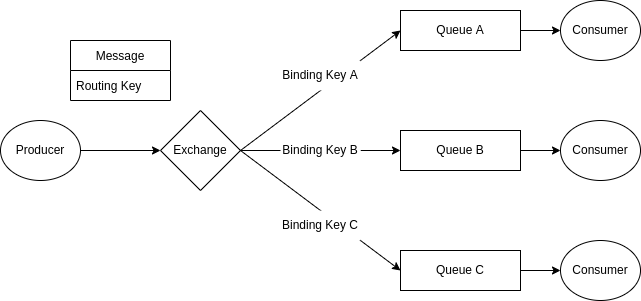
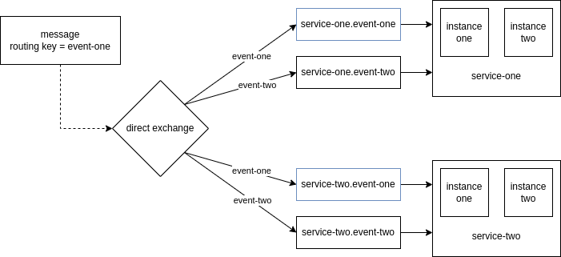

In this blog, I would cover my understanding of Microservices.

# Microservices Advantage

- reasoning about the codebase becomes easy as each service solves a specific problem
- each service can be developed in parallel. this helps release independent features quicker. in case of a monolith, we had to consolidate changes over a period of time and deploy them at once which increased the chances of bugs and increased time of feedback loop cycle
- scaling services individually - suppose different kinds of services need different resource requirements e.g. a service needs more io while another needs more cpu. we can also scale services horizontally e.g. worker services with higher loads can have more running instances. in a monolith, all services run on the same big instance, and we would have to scale the entire instance i.e. vertical scaling 
- since each service is built separately, they can use different languages and frameworks based on requirements
- polyglot persistence i.e. each service has its own persistence layer
- improves fault isolation i.e. if a service goes down, it doesn't affect the functionality of other services
- loosely coupled e.g. if the database of a service changes, it should have no effect whatsoever on other services

# Discovery Server

- if multiple instances of a service (say serviceX) are running, how can another service (say serviceY) communicate to serviceX?
- one way could be to use server side load balancing i.e. requests from serviceY hit a load balancer first, which then directs requests to instance of serviceX using by using round robbin
- however, this has latency as there are now two requests instead of one as serviceY could have directly reached serviceX instances without the load balancer
- the solution is to use a discovery server, which maintains a list of ip address for each service
- now, each instance first registers itself with a discovery server, and serviceY contacts the discovery server to get the list of addresses for serviceX
- every instance sends a heartbeat to the discovery server regularly to notify the discovery server that it is operating normally. the discovery server can declare the instance of a service as unhealthy after it doesn't receive a valid heartbeat status a certain number of times for a certain time period

# Client Side Load Balancing

- but, serviceY is still making two requests - one to the discovery server and the next to make a request to one of the ip addresses of serviceX
- this is why we use client side load balancing
- we cache the results from discovery server in instances of serviceY so that we don't have to make requests to the discovery server repeatedly
- an advantage of server side load balancing was that it could distribute traffic equally using round robbin, but serviceY cannot achieve this itself
- serviceY doesn't know how many requests are being made to an instance of serviceX
- serviceY does this by using weighted round robbin based on response time from an instance of serviceX
- the instances can refresh their cache regularly to account for the continuous changes in discovery server like stopping of instances, starting of new instances, etc

# Retry

- assume serviceY is making requests to serviceX and serviceX is down
- what if a service is down or a few instances of a service is down?
- it takes time for changes in the discovery server to propagate to the instances which initiate the request, as discovery server needs three heartbeat failures and client side load balancing cache refreshes every 30s
- retry mechanisms are used e.g. serviceY can retry 3 times to make requests to serviceX

# Fallback

if all retries fail as well, a "fallback" method can be run, which returns a default response e.g. an empty list in case of an e-commerce application which returns a list of products

# Rate Limiting

- we should limit the rate at which calls are allowed to service
- this way a service can process requests from all services instead of all its threads getting blocked due to serving requests by one service only
- it can also protect against attacks like denial of service

# Bulkhead

- assume one of the endpoints of serviceY is making requests to serviceZ and that serviceZ is very slow
- what if serviceY has a thread pool of 100 threads, and all requests require it to talk to serviceZ?
- requests which do not require serviceY to talk to serviceZ will be kept waiting unnecessarily
- to combat this issue, a certain number of threads are reserved for requests to each service e.g. 70 threads to reach out serviceZ, 30 threads for serviceX, and so on
- note: this would not have been a problem had we used reactive programming

# Circuit Breaker

- assume serviceY is making requests to serviceX and serviceX is down
- serviceY made a request to serviceX and since serviceX is down, it used the retry and fallback mechanism
- but requesting so many times to serviceX just to receive an error results in latency
- serviceY can cache the fact that serviceX will result in an error, and for a certain threshold instead of actually initiating the request, jump to the conclusion that the request will fail to reduce latency

# Api Gateway

- cleints communicate with api gateway instead of talking to the different services directly
- the api gateway acts as a reverse proxy
- it can also act as a load balancer
- it can also handle pre-processing on requests and post-processing on response

# Config Server

- configuration of an application shouldn't be tied to the application
- we shouldn't have to redeploy the application manually if the configuration changes
- we can have a lot of environments like dev, staging, prod, etc. and managing them can be tough
- we can also have sensitive information like database passwords
- a lot of configuration is there for every microservice, much of which is common
- so, we need a central place to manage all this configuration, which we can achieve using a config server
- each microservice on bootstrap pulls its configuration from this config server
- config server can have various sources like git online repository, vault, local file system, etc
- there are two approaches - **config first** and **discovery first**
- in config first, the services fetch all details, including discovery server details from the config server. many config servers can sit behind a load balancer, this way the config servers are highly available. config servers run separately from discovery server, microservices, etc., and behave like an endpoint for microservices so that they can fetch their config
- in discovery first, the services connect to the discovery server first, treat config server like just another service and so eventually retrieve configuration after establishing connection to the discovery server
- i like config first because this would mean only config server url and bare minimum configuration needs to be mentioned in the microservices, rest of the configuration can be fetched from the config server, where configuration for different services can be managed easily

# Asynchronous Messaging

- assume a client makes requests to serviceY which requires serviceY to make requests to serviceX
- the client and serviceY will have to wait for serviceX to respond - this results in coupling of services
- what if the processing in serviceX doesn't affect the response e.g. it only needs to update database entries?
- what if serviceX is down?
- so, we can asynchronously deliver messages and not expect a synchronous response
- serviceX will process the message eventually whenever it has running instances

# RabbitMQ

- implements AMQP (advanced message queuing protocol)
- producer sends messages to exchange
- consumer receives messages from queue
- exchanges connect to queues via binding keys
- messages have routing keys
- exchanges decide which queues to send the messages by comparing routing keys and binding keys

types of rabbitmq exchange - 
- fanout - ignore the routing key and send the message to all queues
- direct - forward messages to queue where the routing key = binding key
- topic - forward messages to queue where the routing key = binding key but the binding key is like a regex
- header - uses the message header instead of the routing key
- default / nameless - match the routing key with the queue name

### How I Use RabbitMQ

doubt: this is how i use rabbitmq for microservices, please let me know if there is a better way

- i use a direct exchange, and all queues are connected to the same direct exchange
- all instances of the same microservice listen to the same queue to process events only once in round robbin
- for each event, there is a separate queue
- optimistic concurrency control: events can be processed out of order specially because of multiple instances, so i maintain a version column in database tables. if a microservice receives an update for a column with version > stored version + 1, i throw an exception. this will cause no acknowledgements to happen and event goes back to rabbitmq, which will again dispatch the event to the queue. [my implementation for spring boot](https://gitlab.com/shameekagarwal/online-judge/-/blob/main/backend/shared/src/main/java/com/onlinejudge/shared/util/EventProcessor.java)
- i have not tried implementing this yet, but maybe at this point after certain number of times of throwing the event back to rabbitmq, it should go to a dead letter queue where admins can decide what to do with it
- the service name is added to the queue name so that two different services don't use the same queue

