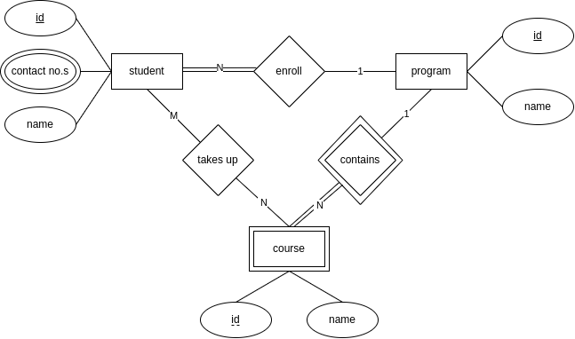

In this blog, I would cover my understanding of Relational Databases.

# Downsides of File Based Systems

- data redundancy - data repeated at different places
- data inconsistency - data update at one place might not be reflected at another place
- difficult data access - searching through records can be difficult
- security problems - granular control to allow access to databases
- difficult concurrent access - erroneous updates if people try editing files simultaneously, file locks allow only one person to edit files at a time
- integrity constraints - we can't enforce constraints like ensuring a specific data type for an attribute
- databases backup and recovery features are less efficient

# Entity Relationship Data Model

- er model is a high-level conceptual data model
- they are used in documentations via er diagrams
- entity - an object like a particular employee or project e.g. an employee jack
- entity type - type of the entity e.g. Employee
- entity set - group of all entities (not entity type)
- attribute - an entity has attributes like age, name
- an entity type is represented as a rectangle
- an attribute is represented as an oval. it can be of following types -
  - simple attribute
  - composite attribute - composed of multiple attributes e.g. name from first name and last name. it is represented as a tree of ovals
  - multivalued attribute - can take an array of values e.g. phone number. the oval has a double outline
  - derived attribute - calculated from other attributes e.g. age from birthdate. the oval has a dotted line
- key attribute - has a value which is distinct for each entity, also called primary key e.g. ssn (social security number) of an employee. represented by an underline on the attribute
- composite key - multiple keys combine to uniquely identify an entity. e.g. vin (vehicle identification number) using state and a number. represent as a composite attribute and underline the key attribute as well
- natural key - use an attribute to uniquely identify an entity. e.g. isbn of book
- relationship - an association between two entities e.g. jack works on project xyz
- relationship type - type of relation e.g. works_on
- relationship set - group of all relationships (not relationship types), just like entity set
- a relationship type is represented as a diamond
- degree - defined on a relationship type, it represents the number of participating entities. it can be of the following types -
  - **unary** (recursive) - an entity type is linked to itself, e.g. an employee supervises another employee
  - **binary** - two entity types are linked, e.g. employee works on a project
  - **ternary** - three entity types are linked, e.g. supplier supplies parts to project
- binary relationship constraints -
  - cardinality - represent by writing 1 / N on the arrow
    - **one to one** - an entity in set a can be associated to at most one entity in set b and vice versa as well e.g. an employee manages a department
    - **one to many** - an entity in set a can be associated to many entities in set b but an entity in set b can be associated to at most one entity in set a e.g. employees are a part of a department
    - **many to many** - an entity in set a can be associated to many entities in set b and vice versa e.g. employees work on a project
  - participation -
    - **total participation** - each entity must participate at least once in the relation, e.g. in employees working on a project, a project has total participation, represented as a double line
    - **partial participation** - an entity need not participate in the relation, e.g. in employees working on a project, an employee has partial participation (e.g. hr), represented as a single line
- attributes on relation types - unless cardinality is many to many, since a table is created for many to many, we should try and move attributes of relationships to one of the tables
- weak entity - they cannot exist independently e.g. a course cannot exist without a program. they don't have key attributes (look above) of their own. they are identified via their owner or identifying entity type, and the relation between the weak and identifying entity is called identifying relationship. the attribute which helps in differentiating between the different weak entities of an identifying entity is called a **partial key**. e.g. dependents of an employee. weak entity is represented as a double line for the rectangle and identifying relationship is represented as a double line for the diamond. partial key is represented as a dotted underline. weak entity should of course, have a total participation
- strong entity - have their own key attributes

# ER Diagram Example

- entities -
  - students have a name, a student identifier, one or more contact numbers
  - programs have a name, a program identifier
  - courses have a name, a course identifier
- relationships -
  - student takes up one or more courses
  - student must enroll in a program
  - program contains courses

# Relational Model

- relation - collection of related data, represented as a table
- tuple - also called records, represented as a row, an instance of the type of object stored in the table
- attribute - represented as a column, describe the record
- relation schema - relation name with its attributes' names e.g. employee(id, name, phone number)
- database schema - combination of all relation schemas
- database instance - information stored in a database at a particular time
- domain - set of acceptable values an attribute can contain
- some properties of a relation -
  - each row is unique i.e. at least the primary key would be different
  - column values are of same kind - columns have a specific data type and all values in it are of this type
  - sequence of columns is insignificant
  - sequence of rows is insignificant
- keys - we need keys to fetch tuples easily and to establish a connection across relations
- different types of keys are -
  - **super key** - set of attributes that can uniquely identify any row. super key is like a power set. e.g. in employee, (id), (phone), (id, name), (name, phone), (id, phone), (id, name, phone) are all super keys
  - **candidate key** - minimal set of attributes that can uniquely identify any row e.g. id, phone number. (id, name) is not a candidate key as id itself can uniquely identify any row
  - **primary key** - one out of all the candidate keys is chosen as the primary key e.g. id of employee
  - **composite key** - candidate keys that have two or more attributes e.g. vehicle(state, number)
  - **alternate key** - any candidate key not selected as the primary key
  - **foreign key** - the primary key of a relation when used in another relation is called a foreign key. it helps in connecting the two relations, the referencing and referenced relation
- integrity constraints - to maintain the integrity of database, following rules are present -
  - **domain constraint** - each value of an attribute must be within the domain
  - **entity integrity constraint** - all relations must have primary key, it cannot be null
  - **referential integrity constraint** - foreign key must either reference a valid tuple or be null
  - **key constraint** - primary key must be unique
- common relational database operations - crud i.e. create, read, update, delete

# Functional Dependency

- X &#10132; Y means given X, we can determine Y e.g. in student(id, name), id &#10132; name but reverse is not true
- X is called **determinant** while Y is called **dependent**
- **armstrong's axioms** are a set of inference rules to determine all functional dependencies
  - axiom of reflexivity - if Y &sube; X, then X &#10132; Y
  - axiom of augmentation - if X &#10132; Y, then XZ &#10132; YZ
  - axiom of transitivity - if X &#10132; Y and Y &#10132; Z, then if X &#10132; Z
- prime attribute - a part of any candidate key
- partial dependency - when a non-prime attribute is dependent on a prime attribute
- transitive dependency - when a non-prime attribute is dependent on another non-prime attribute

# Normalization

- normalization helps in determining the level of redundancy in a database and providing fixes for them
- there are six normal forms, but only 1nf, 2nf, 3nf and bcnf have been discussed

# First Normal Form

for being in first normal form or 1nf, relation shouldn't have a multivalued attribute. e.g.

| id  | name | phone                  |
|-----|------|------------------------|
| 1   | jack | 8745784547, 6587784512 |
| 2   | jane | 3412478452             |

should be converted to

| id  | name | phone      |
|-----|------|------------|
| 1   | jack | 8745784547 |
| 1   | jack | 6587784512 |
| 2   | jane | 3412478452 |

# Second Normal Form

for being in second normal form or 2nf, relation should be in 1nf and shouldn't have partial dependencies. e.g.

| student_id | course_id | course_fee |
|------------|-----------|------------|
| 1          | 1         | 120        |
| 2          | 2         | 150        |
| 1          | 2         | 150        |

this has partial dependency course_id &#10132; course_fee since primary key is (student_id, course_id).  
so, it should be split into two tables

| student_id | course_id |
|------------|-----------|
| 1          | 1         |
| 2          | 2         |
| 1          | 2         |

| course_id | course_fee |
|-----------|------------|
| 1         | 120        |
| 2         | 150        |

note how this also reduced data redundancy by storing the course_fee values only once

# Third Normal Form

for being in third normal form or 3nf, relation should be in 2nf and shouldn't have transitive dependencies. e.g.

| student_id | country | capital   |
|------------|---------|-----------|
| 1          | india   | delhi     |
| 2          | nepal   | kathmandu |
| 3          | nepal   | kathmandu |

this has transitive dependency country &#10132; capital since the capital can be derived from country, and the primary key is student_id. so, it should be split into

| student_id | country |
|------------|---------|
| 1          | india   |
| 2          | nepal   |
| 3          | nepal   |

| country | capital   |
|---------|-----------|
| india   | delhi     |
| nepal   | kathmandu |

# Boyce Codd Normal Form

- for being in boyce-codd normal form or bcnf, relation should be in 3nf and a dependency A &#10132; B is allowed only if A is a super key, doesn't matter what B is which make sense, as super keys should be able to find everything. so to check for bcnf, only check if lhs of dependency is super key or not
- e.g. - AB &#10132; C and C &#10132; B. candidate keys are AB and AC. neither of the dependencies are partial or transitive, so it is in 3nf already. however, C is not a super key, yet we have C &#10132; B. so, it is not in bcnf
- basically, since prime &#10132; non-prime was covered in 2nf, non-prime &#10132; non-prime was covered in 3nf, we wanted to remove (prime / non-prime) &#10132; prime in bcnf