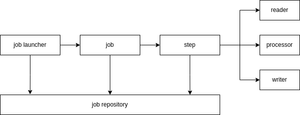
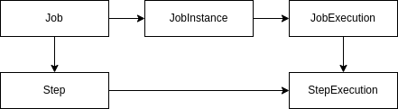
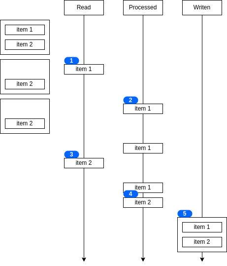

In this blog, I would cover my understanding of Spring Batch.

# Batch Jobs

- usually they are background processes that are run periodically
- batch jobs don't need human interaction
- they read from a dataset, process each item and then accumulate that data
- they are usually run on a schedule to process a few accumulated items at once
- they usually follow an etl pattern i.e. extract, transform and then load that data
- batch jobs have a particular architecture which spring batch implements with an easy to use api

# Spring Batch Architecture

- jobs - the entire batch process that we want to execute
- step - the phases in a job to execute a particular functionality
- steps can be executed after one another conditionally or in parallel
- spring batch writes metadata to a job repository about which jobs succeeded, which ones failed, etc. job repository can write to databases, i have used mysql. different tables like `BATCH_JOB_INSTANCE`, `BATCH_JOB_EXECUTION`, etc. are created



- a job launcher creates a job by passing the name of the job and the job parameters
- the combination of job name and job parameters is called a job instance
- an execution of job instance is called a job execution
- a job instance can usually only be executed once successfully
- the job parameters have to change to re-execute
- a job instance can be executed multiple times by spring batch itself due to failures
- just like jobs, steps have a step execution too



- in spring batch, there are two kinds of steps - tasklet and chunk based steps
- tasklet steps - lightweight methods, do not utilize the out-of-the-box components
- chunk based steps - uses interfaces like `ItemReader`, `ItemWriter` and optionally `ItemProcessor`. this is where spring batch has support for common data sources to make development easier

# A Minimal Example

- `@EnableBatchProcessing` is used to automatically create different beans like `JobBuilderFactory`
- this is my guess - `JobLauncherApplicationRunner` or `JobLauncherCommandLineRunner`, brought in due to `@EnableBatchProcessing` is what causes the jobs to be started automatically when the application is started. use `spring.batch.job.enabled=false` to remove this
- we can return different `RepeatStatus` like `FINISHED` and `CONTINUABLE`

```java
@EnableBatchProcessing
@Configuration
@RequiredArgsConstructor
@Slf4j
public class BatchConfig {

  private final JobBuilderFactory jobBuilderFactory;
  private final StepBuilderFactory stepBuilderFactory;

  @Bean
  public JobParametersBuilder jobParametersBuilder() {
    return new JobParametersBuilder();
  }

  @Bean
  public Job deliverPackageJob() {
    return jobBuilderFactory.get("deliverPackageJob")
        .start(packageItemStep())
        .build();
  }

  @Bean
  public Step packageItemStep() {
    return stepBuilderFactory.get("packageItemStep")
        .tasklet((stepContribution, chunkContext) -> {
          String item = (String) chunkContext.getStepContext().getJobParameters().get("item");
          log.info("packaging item {}...", item);
          return RepeatStatus.FINISHED;
        })
        .build();
  }
}

@Component
@RequiredArgsConstructor
@Slf4j
public class BatchLauncher implements CommandLineRunner {
  private final JobLauncher jobLauncher;
  private final JobParametersBuilder jobParametersBuilder;
  private final Job deliverPackageJob;

  @Override
  public void run(String... args) throws Exception {
    log.info("starting batch job...");
    JobParameters jobParameters = jobParametersBuilder
        .addString("item", "shoes")
        .toJobParameters();
    jobLauncher.run(deliverPackageJob, jobParameters);
  }
}
```

# Building Complex Flows

- we can transition from one step to another sequentially using `next`
  ```java
  ...
  .start(step1())
  .next(step2())
  .next(step3())
  ...
  ```
- only failed or stopped jobs can be restarted by spring batch, not completed jobs
- spring batch starts executing the job from the step that failed
- the most difficult part is creating flows - how steps are executed, in what order, etc
- to simulate if else, we use `on`, `to` and `from` transitions
  ```java
  ...
  .start(step1())
  .on("FAILED").to(step2())
  .from(step1())
  .on("*").to(step3())
  ...
  ```
- spring batch has two statuses - `BatchStatus` and `ExitStatus`. `BatchStatus` is used by spring batch to record execution status of job execution and step execution. however, `ExitStatus` is what we use while determining transitions in the earlier point, and unlike `BatchStatus` which is a fixed enum, we can return custom exit statuses to determine transitions. [refer docs](https://docs.spring.io/spring-batch/docs/current/reference/html/index-single.html#batchStatusVsExitStatus)
- we can implement `JobExecutionDecider` to run after a step, and return a custom status for the next steps
  ```java
  @Slf4j
  public class DeliveryDecider implements JobExecutionDecider {
    public static final String PRESENT = "PRESENT";
    public static final String ABSENT = "ABSENT";

    @Override
    public FlowExecutionStatus decide(JobExecution jobExecution, StepExecution stepExecution) {
      return new FlowExecutionStatus(PRESENT);
    }
  }
  ...
  @Bean
  public JobExecutionDecider deliveryDecider() {
    return new DeliveryDecider();
  }
  ...
  .to(deliveryDecider())
    .on(DeliveryDecider.PRESENT).to(givePackageToCustomerStep())
  .from(deliveryDecider())
    .on(DeliveryDecider.ABSENT).to(leaveAtDoorstepStep())
  ```
- three transitions called `end`, `fail` and `stop` are provided by spring batch to control the batch status of a job. by default jobs are marked completed unless stated otherwise. we might want to declare a job as stopped so that it can be run at a later point of time. (recall how failed or stopped jobs can be restarted by spring batch). in the example below, we are changing the exit status
  ```java
  .on(ExitStatus.FAILED.getExitCode()).stop()
  ```
- listeners can be interjected at different levels to modify logic, e.g. we can add header information to the file after it has been written. we can have job listeners, different step listeners, skip and retry listeners, etc. a few of them are listed [here](https://docs.spring.io/spring-batch/docs/current/reference/html/step.html#interceptingStepExecution)
  ```java
  @Slf4j
  public class FlowerSelectionListener implements StepExecutionListener {

    public static final String TRIM_REQUIRED = "TRIM_REQUIRED";
    public static final String TRIM_NOT_REQUIRED = "TRIM_NOT_REQUIRED";

    @Override
    public void beforeStep(StepExecution stepExecution) {
      log.info("executing before part of FlowerSelectionListener...");
    }

    @Override
    public ExitStatus afterStep(StepExecution stepExecution) {
      log.info("executing after part of FlowerSelectionListener...");
      String flowerType = stepExecution.getJobParameters().getString("flower-type");
      String result = "rose".equals(flowerType) ? TRIM_REQUIRED : TRIM_NOT_REQUIRED;
      return new ExitStatus(result);
    }
  }
  ...
  @Bean
  public StepExecutionListener flowerSelectionListener() {
    return new FlowerSelectionListener();
  }
  ...
  @Bean
  public Step selectFlowersStep() {
    return stepBuilderFactory.get("selectFlowersStep")
        .tasklet((stepContribution, chunkContext) -> {
          log.info("selecting flowers...");
          return RepeatStatus.FINISHED;
        })
        .listener(flowerSelectionListener())
        .build();
  }
  ```
- we can use external flows inside spring batch. e.g. both job 1 and job 2 require a series of steps - step a, step b and step c. we can create a flow out of the three steps and now both jobs can reference this flow. this way if the flow is changed, it gets reflected in both jobs. syntax for using flows is pretty much like steps, as they can be used interchangeably
  ```java
  @Bean
  public Flow deliveryFlow() {
    return new FlowBuilder<SimpleFlow>("deliveryFlow")
        .start(driveToAddressStep())
        .end();
  }
  ```
- we can use job steps, to nest jobs inside one another for a similar reason. remember job executions would be created in this case unlike in flows
- we can execute steps in parallel to improve the performance of jobs
  ```java
  .start(packageItemStep())
  .split(new SimpleAsyncTaskExecutor())
  .add(deliveryFlow(), billingFlow())
  .end()
  .build()
  ```

# Chunk Based Steps

- read items from a datastore using an `ItemReader`, process these items using an `ItemProcessor`, and then write them to a datastore using an `ItemWriter`
- we provide the chunk size
- each item is read and processed one by one, however they are written in chunks using transactions
- my understanding - the two type arguments are the output of reader and the input to writer respectively -
  ```java
  @Bean
  public Step chunkBasedStep() throws Exception {
    return stepBuilderFactory.get("chunkBasedStep")
        .<Order, Order>chunk(3)
        .reader(reader())
        .writer(writer())
        .build();
  }
  ```
- in the example below, the chunk size is two



- we need to implement `ItemReader` and override `read()` for reading data from datasources one at a time. by returning null from the `read` method, we signal that reading of data is complete
  ```java
  public class StringItemReader implements ItemReader<String> {

    private final List<String> names = List.of("Faiz", "Darrel", "Farrah");
    private final Iterator<String> iterator = names.iterator();

    @Override
    public String read() throws Exception {
      return iterator.hasNext() ? iterator.next() : null;
    }
  }
  ```
- spring batch already provides implementations for common datasources
- specifying an order to read data in is important to prevent inconsistencies, e.g. when specifying the select clause to use while reading from relational databases
- there are different item readers for jdbc for single and multithreaded scenarios, implemented using `JdbcCursorItemReader` and `JdbcPagingItemReader` respectively
  ```java
  public class JdbcRowMapper implements RowMapper<Order> {

    @Override
    public Order mapRow(ResultSet resultSet, int rowNum) throws SQLException {
      Order order = new Order();
      order.setOrderId(resultSet.getLong("order_id"));
      order.setFirstName(resultSet.getString("name"));
      order.setItemId(resultSet.getString("item_id"));
      return order;
    }
  }
  ...
  @Bean
  public ItemReader<Order> jdbcMultiThreadedItemReader() throws Exception {
    return new JdbcPagingItemReaderBuilder<Order>()
        .dataSource(dataSource)
        .name("jdbcPagingItemReader")
        .queryProvider(pagingQueryProvider())
        .rowMapper(new JdbcRowMapper())
        .pageSize(3)
        .build();
  }
  ...
  @Bean
  public PagingQueryProvider pagingQueryProvider() throws Exception {
    SqlPagingQueryProviderFactoryBean factory = new SqlPagingQueryProviderFactoryBean();
    factory.setSelectClause("select order_id, name, item_id");
    factory.setFromClause("from shipped_order");
    factory.setSortKey("order_id");
    factory.setDataSource(dataSource);
    return factory.getObject();
  }
  ```
- my understanding - in cursor based implementations, cursor moves one at a time, we deserialize it and so on. in page based implementations, we read a few items at once
- there is also a [JpaPagingItemReader](https://docs.spring.io/spring-batch/docs/current/reference/html/readersAndWriters.html#JpaPagingItemReader)
- spring batch provides support for transactions, particularly useful for writers. writers write data in chunks, and if writing even one record fails, spring batch rolls back all the changes to prevent inconsistencies in data
- `beanMapped` helps in using attributes directly in the sql, this method is called named parameters -
  ```java
  @Bean
  public ItemWriter<Order> jdbcItemWriter() throws Exception {
    return new JdbcBatchItemWriterBuilder<Order>()
        .dataSource(dataSource)
        .sql("insert into shipped_order_output(order_id, name, item_id) values (:orderId, :name, :itemId)")
        .beanMapped()
        .build();
  }
  ```
- `ItemProcessor` is a generic with two type arguments - the type of the object inputted and the type of the transformed object outputted
- we can validate items, so only valid items reach the `ItemWriter`. we can use validation here means using the annotations which come with `spring-boot-starter-validation`, thanks to `BeanValidatingItemProcessor`
  ```java
  public class Order {
    ...
    @Pattern(regexp = ".*\\.gov")
    private String email;
    ...
  }
  ...
  @Bean
  public ItemProcessor<Order, Order> orderValidatingItemProcessor() {
    BeanValidatingItemProcessor<Order> itemProcessor = new BeanValidatingItemProcessor<>();
    itemProcessor.setFilter(true);
    return itemProcessor;
  }
  ```
- we can implement custom processors as well - 
  ```java
  public class TrackedOrderItemProcessor implements ItemProcessor<Order, TrackedOrder> {

    @Override
    public TrackedOrder process(Order order) throws Exception {
      return new TrackedOrder(
          order,
          UUID.randomUUID().toString(),
          false
      );
    }
  }
  ...
  @Bean
  public ItemProcessor<Order, TrackedOrder> trackedOrderItemProcessor() {
    return new TrackedOrderItemProcessor();
  }
  ```
- `CompositeItemProcessor` is used for chaining multiple processors - 
  ```java
  @Bean
  public CompositeItemProcessor<Order, TrackedOrder> compositeItemProcessor() {
    return new CompositeItemProcessorBuilder<Order, TrackedOrder>()
        .delegates(orderValidatingItemProcessor(), trackedOrderItemProcessor())
        .build();
  }
  ```
- just like in `ItemReader` method we return null to signal reading of data from datasource is complete, we can also return null from `ItemProcessor` to indicate we want to skip the item, so `ItemProcessor` here works like a filter as well
  ```java
  public class FreeShippingItemProcessor implements ItemProcessor<TrackedOrder, TrackedOrder> {

    @Override
    public TrackedOrder process(TrackedOrder trackedOrder) throws Exception {
      trackedOrder.setFreeShipping(trackedOrder.getCost().compareTo(BigDecimal.valueOf(80)) > 0);
      return trackedOrder.getFreeShipping() ? trackedOrder : null;
    }
  }
  ```

# Resilience in Spring Batch

- we can configure spring to skip non-critical executions that fail
- we set the exception for which spring batch should skip, and can also set how many times spring batch should be okay with skipping, as too many skips could indicate something fishy. we can also set a listener to listen for items which were skipped, which we could then handle accordingly
  ```java
  @Slf4j
  public class CustomSkipListener implements SkipListener<Order, TrackedOrder> {
    @Override
    public void onSkipInRead(Throwable throwable) { }

    @Override
    public void onSkipInWrite(TrackedOrder trackedOrder, Throwable throwable) { }

    @Override
    public void onSkipInProcess(Order order, Throwable throwable) {
      log.info("skipping processing of item {}", order);
    }
  }
  ...
  @Bean
  public Step chunkBasedStep() throws Exception {
    return stepBuilderFactory.get("chunkBasedStep")
        .<Order, TrackedOrder>chunk(3)
        .reader(jdbcMultiThreadedItemReader())
        .processor(compositeItemProcessor())
        .faultTolerant()
        .skip(OrderProcessingException.class)
        .skipLimit(5)
        .listener(new CustomSkipListener())
        .writer(jsonItemWriter())
        .build();
  }
  ```
- we can also retry failed executions, it has similar configuration options to skip. retry limit indicates how many times the execution would be run again in case it fails for a particular item. when we first fail, `open` is invoked, when we fail for the last time, `close` is invoked, everytime an exception occurs, `onError` is called
  ```java
  @Slf4j
  public class CustomRetryListener implements RetryListener {
    @Override
    public <T, E extends Throwable> boolean open(RetryContext retryContext, RetryCallback<T, E> retryCallback) {
      if (retryContext.getRetryCount() > 0) log.info("starting to retry...");
      return true;
    }

    @Override
    public <T, E extends Throwable> void close(RetryContext retryContext, RetryCallback<T, E> retryCallback, Throwable throwable) { }

    @Override
    public <T, E extends Throwable> void onError(RetryContext retryContext, RetryCallback<T, E> retryCallback, Throwable throwable) {
      if (retryContext.getRetryCount() > 0) log.info("about to retry...");
    }
  }
  ...
  @Bean
  public Step chunkBasedStep() throws Exception {
    return stepBuilderFactory.get("chunkBasedStep")
        .<Order, TrackedOrder>chunk(3)
        .reader(jdbcMultiThreadedItemReader())
        .processor(compositeItemProcessor())
        .faultTolerant()
        .retry(OrderProcessingException.class)
        .retryLimit(3)
        .listener(new CustomRetryListener())
        .writer(jsonItemWriter())
        .build();
  }
  ``` 
- we can also make the single step itself be executed by multiple threads. for now, i am skipping this

# Scheduling Jobs

- there are two solutions to scheduling in spring -
  - quartz, can be added via `spring-boot-starter-quartz`
  - spring scheduler, no need to add any extra dependency
- here, i have used the spring scheduler

```java
@EnableBatchProcessing
@EnableScheduling
@Configuration
@RequiredArgsConstructor
@Slf4j
public class BatchConfig {
  private final JobBuilderFactory jobBuilderFactory;
  private final StepBuilderFactory stepBuilderFactory;
  private final JobLauncher jobLauncher;

  @Scheduled(cron = "0/30 * * * * *")
  public void run() throws Exception {
    log.info("starting batch job...");
    JobParameters jobParameters = new JobParametersBuilder()
        .addDate("date", new Date())
        .toJobParameters();

    jobLauncher.run(job(), jobParameters);
  }

  @Bean
  public Job job() {
    return jobBuilderFactory.get("job")
        .start(step())
        .build();
  }

  @Bean
  public Step step() {
    return stepBuilderFactory.get("step")
        .tasklet((stepContribution, chunkContext) -> {
          log.info("run time is {}", LocalDateTime.now());
          return RepeatStatus.FINISHED;
        })
        .build();
  }
}
```
