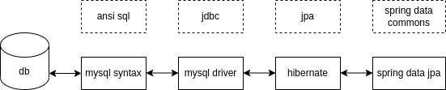
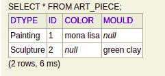
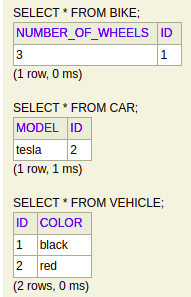

In this blog, I would cover my understanding of persistence in spring.

# About

- orm - object relation mapping,
  - map a pojo (plain old java object) to the table rows in the database
  - handle relationships like one to many, etc
  - we just have to configure entities using right annotations, sql queries are automatically generated
- spring data has support for common persistence solutions like redis, mongodb, sql based databases, etc
- spring data jpa is an abstraction layer over hibernate
- hibernate it is an implementation of jpa (java persistence api)
- jdbc or java database connectivity helps connect to a database
- jdbc too is just an api which jdbc drivers implement, e.g. there are different drivers for postgres and mysql
- we use repositories which handle everything related to persistence. we just have to declare an interface while spring data jpa provides us with the implementation
- relational databases are very efficient, data jpa is not that efficient & so it is not great for batch operations



# Equals and HashCode

we should generate `equals` and `hashCode` based on id field. to work with lombok, use [this](https://stackoverflow.com/a/56908141/11885333)

```java
@Override
public boolean equals(Object o) {
  if (this == o) return true;
  if (o == null || getClass() != o.getClass()) return false;
  Book book = (Book) o;
  return Objects.equals(id, book.id);
}

@Override
public int hashCode() {
  return Objects.hash(id);
}
```

# Repositories

- `@CrudRepository` & `@PagingAndSortingRepository` are a part of spring data commons, i.e. if we use them we can easily switch between databases if we wanted to later on while the code would not change
- spring data commons is what various distributions like spring data jpa, spring data mongodb, etc implement
- `@JpaRepository` is a part of spring data jpa and helps get a lot of jpa specific functionality with this as well

# Accounts

- we should create a separate schema / database for each application
- we should create two accounts which can perform operations on this database only
- one account should have higher privileges, as it would carry out database migrations while the other account should be restricted to run crud operations only

```sql
create user `account_service_user`@`%` identified with mysql_native_password by 'ghXrqvPhKuI6RedaEh7l';
grant select, insert, update, delete on `account_service`.* to `account_service_user`@`%`;

create user `account_service_admin`@`%` identified with mysql_native_password by 'm9EfTq7RfbFdUqGWS0OM';
grant select, insert, update, delete, create, drop, references, index, alter, execute on `account_service`.* to `account_service_admin`@`%`;
```

# Hibernate Schema Generation

- hibernate can use sql statements to automatically generate ddl (data definition language)
- the different available options can be viewed [here](https://docs.jboss.org/hibernate/orm/5.4/userguide/html_single/Hibernate_User_Guide.html#configurations-hbmddl)
  - `create` - drop the schema and recreate it and the tables from the entities
  - `validate` - if the tables don't match the entities, results in a fatal error. it's a fail fast approach which is preferred in production to prevent bugs
  - `update` - update the tables from the entities. good for rapid prototyping
  - `create-drop` - like `create` but drop the tables after the application shuts down
- it converts camel case to snake case by default for attributes
- the exact property name is `spring.jpa.hibernate.ddl-auto=update`

# Flyway

- database migration - helps upgrade schemas and tables, go back to an older state, etc. without the loss of data
- commands -
  - `migrate` - migrate to the latest version
  - `clean` - drop all database objects, **should not be used for production**
  - `info` - print information about the migrations
  - `validate` - check if migrations have been applied
  - `undo` - revert most recent migration
  - `baseline` - used when flyway is introduced to an existing database
  - `repair` - used to fix problems with schema history table
- file naming convention - `V<version-number>__comment.sql` e.g. `V1.0__init-database.sql`
- running flyway commands from code. e.g. -
  ```java
  @Profile({"clean"})
  @Configuration
  public class DBClean {

    @Bean
    public FlywayMigrationStrategy clean() {
      return flyway -> {
        flyway.clean();
        flyway.migrate();
      };
    }
  }
  ```

# Primary Keys

- `@Id` - it helps map a pojo to the primary key of the table
- `@GeneratedValue` - how the id field should be generated. if the strategy is `GenerationType.AUTO`, hibernate picks up the correct strategy automatically based on the type of the database. when we use `GenerationType.AUTO` with mysql, it defaults to `GenerationType.TABLE` i.e. a table is used to maintain the id value. it is not scalable as a table is created and queried. `GenerationType.IDENTITY` allows for auto-incremented database columns
- uuid - 128 bit unique identifier. helps in database indexing, but does require more storage
- adding a uuid column -
  - migration script -
    ```sql
    alter table book change id id binary(16) not null;
    ```
  - id attribute -
    ```java
    @Id
    @GeneratedValue(generator = "uuid2")
    @GenericGenerator(name = "uuid2", strategy = "uuid2")
    @Column(columnDefinition = "binary(16)", updatable = false)
    private UUID id;
    ```
- another approach commonly used is to not use the auto generated database id, and instead of it add another public id like uuid which is used by the frontend to communicate with the backend. the database id is just stored in the database and not used

# Hibernate Terms

- `SessionFactory` - expensive to create, therefore the application should have only one instance of it. its jpa equivalent is `EntityManagerFactory`
- `Session` - single threaded, short-lived and inexpensive to create. it is a wrapper around a jdbc connection and its jpa equivalent is `EntityManager`
- `Transaction` - single threaded, used to define transaction boundaries. its jpa equivalent is `EntityTransaction`
- entity states - 
  - transient - not associated with a session as it has just been instantiated
  - managed or persistent - associated with a session, changes may not have been propagated to the db
  - detached - not being tracked by a session as session was closed / it was evicted from the session
  - removed - scheduled for removal from the database
- caching - hibernate has two levels of cache
  - first level cache - hibernate will cache entities in the session, makes operations efficient
  - second level cache - disabled by default, recommended to enable on a per-entity basis
- caching problems - if we try to insert a lot of objects into the database at once, our jvm memory can blow up as there would be a lot of  objects in the cache. we can fix this using jdbc batching, so that operations happen in batches. `flush()` and `clear()` methods help clear session cache

# Mapping Examples

<details>
  <summary>One to One Bidirectional</summary>

```java
@Entity
@Getter @Setter @NoArgsConstructor @AllArgsConstructor @ToString
public class Owner {

  @Id
  @GeneratedValue(strategy = GenerationType.IDENTITY)
  private Long id;

  private String name;

  @OneToOne(fetch = FetchType.LAZY)
  @ToString.Exclude
  private Car car;

}
```

```java
@Entity
@Getter @Setter @NoArgsConstructor @AllArgsConstructor @ToString
public class Car {

  @Id
  @GeneratedValue(strategy = GenerationType.IDENTITY)
  private Long id;

  private String model;

  @OneToOne(mappedBy = "car", fetch = FetchType.LAZY)
  @ToString.Exclude
  private Owner owner;

}
```

</details>

<details>
  <summary>One to Many Bidirectional</summary>

```java
@Entity
@Getter @Setter @NoArgsConstructor @AllArgsConstructor @ToString
public class Cart {

  @Id
  @GeneratedValue(strategy = GenerationType.IDENTITY)
  private Long id;

  private String name;

  @OneToMany(
      mappedBy = "cart",
      cascade = CascadeType.ALL,
      orphanRemoval = true,
      fetch = FetchType.LAZY
  )
  @ToString.Exclude
  private List<Item> items = new ArrayList<>();

}
```

```java
@Entity
@Getter @Setter @NoArgsConstructor @AllArgsConstructor @ToString
public class Item {

  @Id
  @GeneratedValue(strategy = GenerationType.IDENTITY)
  private Long id;

  private String name;

  @ManyToOne(fetch = FetchType.LAZY)
  @ToString.Exclude
  private Cart cart;

}
```

</details>

<details>
  <summary>Many to Many Bidirectional</summary>

```java
@Entity
@Getter @Setter @NoArgsConstructor @AllArgsConstructor @ToString
public class Stream {

  @Id
  @GeneratedValue(strategy = GenerationType.IDENTITY)
  private Long id;

  @ManyToMany(mappedBy = "streams", fetch = FetchType.LAZY)
  @ToString.Exclude
  private List<Viewer> viewers = new ArrayList<>();

}
```

```java
@Entity
@Getter @Setter @NoArgsConstructor @AllArgsConstructor @ToString
public class Viewer {

  @Id
  @GeneratedValue(strategy = GenerationType.IDENTITY)
  private Long id;

  @ManyToMany(fetch = FetchType.LAZY)
  @ToString.Exclude
  private List<Stream> streams = new ArrayList<>();

}
```

</details>

<details>
  <summary>Mapped Superclass</summary>

```java
@MappedSuperclass
@Getter @Setter @NoArgsConstructor @AllArgsConstructor @ToString
public abstract class Vehicle {

  @Id
  @GeneratedValue(strategy = GenerationType.AUTO)
  private Long id;

  private String name;

}
```

```java
@Entity
@Getter @Setter @NoArgsConstructor @AllArgsConstructor @ToString
public class Truck extends Vehicle {
  private Integer load;
}
```

```java
@Entity
@Getter @Setter @NoArgsConstructor @AllArgsConstructor @ToString
public class Tank extends Vehicle {
  private Integer firePower;
}
```

</details>

# Mapping Tips

- `mappedBy` signifies that the current class is the child / non owner side of the relationship. in many to many, it can be placed on either side of the relationship
- `@JoinColumn`, is used for both one-to-one and one-to-many and is optional. it helps specify the name of the columns to use in database tables. it is used on the owner side of the relation
- `@JoinTable`, is used for many-to-many and is optional. it helps specify the name of the columns and table which is used for maintaining the mapping. it is used on the side of the relation where `mappedBy` was not used
- by default some fetch types are eager, and some like `@OneToMany` are lazy
- set `orphanRemoval` to true to delete entities which have been removed from the relationship, default is false
- use `CascadeType.ALL`, specially for owner relations, this way if the owner gets deleted, its child is deleted too. also, the child would automatically get persisted to database, e.g.
  ```java
  cart.addItem(item);
  cartRepository.save(cart); // this line would save item to the database as well
  ```
- use `@ToString.Exclude` of lombok for all relation attributes
- use `@MappedSuperclass` for a base entity from which all other entities can inherit. this base entity should be an abstract class so that no one can instantiate it, and it can have all common attributes required by all entities like version, created and updated at, id, etc
- in single table strategy, only one database table would be created for all classes, with columns corresponding to union of all the attributes for all entities including parent. to decide which class the row belongs to, a column is used. this column is `DTYPE` by default, and can be overridden using `@DiscriminatorColumn`. in this example, `color` is present on the child painting while `mould` is present on the child sculpture 
- in join table strategy, queries would be inefficient since joins would be required for each retrieval. the parent entity would have all common fields of children and an id and get stored to the database in a table of it own. the child tables would too have an id which gets stored into separate database tables, but their ids would have a foreign key constraint as well, which points to the parent entity. in this example, `color` is present on the parent vehicle while `numberOfWheels` on the child bike and `model` on the child car 

# Querying in JPA

- using query dsl or domain specific language provides with query validity, as code will be checked at compile time
- the method name we write gets converted to jpql, which again gets converted to sql
- e.g. for and - `public List<Speaker> findByFirstNameAndLastName(String firstName, String lastName);`
- e.g. for equals - `findByLength`, `findByLengthIs`, `findByLengthEquals` all use the `=` symbol for comparison
- e.g. for not equals - `findByLengthNot` uses the `!=` symbol for comparison
- e.g. for like - `public List<Session> findBySessionNameNotLike(String sessionName);`, but, we have to add the symbol manually, i.e. - `jpaRepository.findBySessionNameNotLike("Java%");`
- to add `%` automatically, use `StartingWith`, `EndingWith`, `Containing`
- we can use `LessThan` for `<`, `GreaterThanEqual` for `>=`, etc
- for dates, we can use `findByDateBefore`, `findByDateAfter`, `findByDateBetween`
- we can use `In` and `NotIn` and pass collections as parameters
- we can make a typeahead by using `ContainingIgnoreCase`
- to the end of the method name, we can add the order by clause. e.g. `findByLastNameOrderByFirstNameAsc`
- limit results using - `findFirstByName`, `findTop5ByName`
- jpql is useful for complex queries, dsl may not be possible or have extremely long method names
- joins are performed automatically when you reference a property with relationships
- e.g. - 
  ```java
  @Query(
    "select tp from TicketPrice tp " + 
    "where tp.basePrice < ?1 " + 
    "and tp.ticketType.includesWorkshop = true"
  )
  public List<TicketPrice> getTicketsUnderPrice(BigDecimal price);
  ```
- sometimes we have fetch type as lazy, but we still want the join to happen in some case
  ```java
  @Query("select s from Submission s join fetch s.question")
  List<Submission> findAllWithQuestion();
  ```
- we can also use named parameters
  ```java
  @Query(
    "select tp from TicketPrice tp " + 
    "where tp.basePrice < :maxPrice " + 
    "and tp.ticketType.includesWorkshop = true"
  )
  List<TicketPrice> getTicketsUnderPrice(@Param("maxPrice") BigDecimal p);
  ```
- we can also set `nativeQuery = true` to write queries in the database language and not in jpql. however, by using this method, we get tied to the database itself
- `@Modifying` can be used along with `@Query` if we want to update rows, the number of rows modified is returned in this case
  ```java
  @Modifying
  @Query("...")
  ...
  ```
- named queries e.g. (note: below is for `@NamedQuery`, we also have `@NamedNativeQuery`
  ```java
  @NamedQuery(
    name = "TicketPrice.namedFindTicketsByPricingCategoryName",
    query = "select tp from TicketPrice tp where tp.pricingCategory.pricingCategoryName = :name"
  )
  @Entity
  public class TicketPrice {
    ...
  }

  public interface TicketPriceJpaRepository extends JpaRepository<TicketPrice, Long> {
    List<TicketPrice> namedFindTicketsByPricingCategoryName(@Param("name") String name);
  }
  ```
- precedence in jpa repository i.e. how spring data jpa tries to resolve queries in case our code matches multiple formats - `@Query` > named query > query dsl
