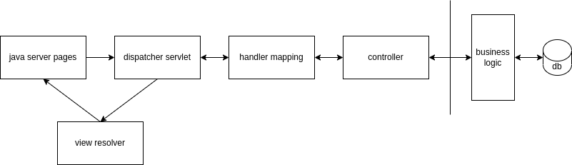

In this blog, I would cover my understanding of spring.

# About Spring

- spring can be used without ejb (enterprise java beans)
- we use spring without using an application server, tomcat is just an embedded lightweight web server now
- we have to write minimum spring related code, and just using pojos suffice
- spring was a successor of j2ee, which solved concerns faced during developing j2ee
- spring uses aop / proxies to apply transactions to reduce spring related code
- by using spring, we automatically use patterns like template method, factories, abstract factories, singleton
- it follows convention over configuration i.e. it works with minimal configuration with developers having to make lesser decisions, but they can override the configuration if needed
- we don't have to implement any spring specific interfaces, we just use annotations
- inversion of control and dependency injection are fundamental concepts of spring
- inversion of control - we don't create objects, destroy objects, etc. all of this is managed by spring itself
- dependency injection - we just declare what dependencies our class needs and the container injects them via setters / constructor during runtime
- dependency injection and inversion of control prevent bugs and help in lose coupling
- application context encapsulates the bean factory, ensures injection of dependencies in the right order because of the dependency graph, etc
- bean factory always maintains a reference to beans with scope singleton and then injects them when and where needed, even if no classes are using it
- bean definitions can come from three sources - java configuration, xml and component scanning
- xml configuration uses applicationContext.xml
- java configuration helps in compile time checking unlike xml
- java configuration replaces xml configuration with `@Configuration`
- when we use `@Bean`, by default the scope is singleton. also, don't worry about calling the method annotated with `@Bean` repeatedly, we always get back the same instance because of spring
- component scanning reduces the code required by java configuration, so instead of using `@Bean` on methods inside `@Configuration` classes, we can just use `@ComponentScan` and specify the package to pick up all classes annotated with `@Component` automatically
- spel or spring expression language, can be used to evaluate values at runtime
- proxies wrap a class to add behavior, e.g. transaction proxies
- proxies help in adding behavior without modifying code
- proxies don't act on internal logic like calling private methods
- bean profiles can be used to run code based on environment
- if we use `@Profile`, beans would be created only in the environments specified inside it

# Minimal Example

```xml
<spring.version>5.3.16</spring.version>

...

<dependency>
  <groupId>org.springframework</groupId>
  <artifactId>spring-context</artifactId>
  <version>${spring.version}</version>
</dependency>
```

ApplicationConfig.java

```java
@Configuration
@ComponentScan({ "org.demo.spring" })
@PropertySource({ "classpath:application.properties" })
public class ApplicationConfig {
  @Value("#{new Boolean(environment['spring.profiles.active'] == 'dev')}")
  private Boolean isDev;

  @Bean
  @Profile({"dev", "prod"})
  public OutputService outputService() {
    return new OutputService(isDev);
  }
}
```

Application.java

```java
public class Application {
  public static void main(String[] args) {
    ApplicationContext context = new AnnotationConfigApplicationContext(ApplicationConfig.class);
    OutputService outputService = context.getBean(OutputService.class);

    // call methods on outputService
  }
}
```

# Bean Scopes

bean scopes - set scope via `@Scope(BeanDefinition.SCOPE_PROTOTYPE)`

- singleton - it is the default scope of beans, one object per application context
- prototype - a new instance is returned everytime it is referenced. so, the instance isn't stored in the container. this also means that once an instance is no longer used / referenced, it gets garbage collected
- web scopes - for web environments, the instance isn't stored in the container
  - session - one instance per user per session
  - request - one instance per http request
  - global session - one instance per application lifecycle, like singleton

# Autowiring

note how for `SpeakerService`, we don't have to call the setter ourselves, its being done by spring automatically because of the `@Autowired` annotation that we added on the setter

```java
public class SpeakerService {

  private SpeakerDao speakerDao;

  @Autowired
  public void setSpeakerDao(SpeakerDao speakerDao) {
    this.speakerDao = speakerDao;
  }

  ...
}

@Configuration
public class ApplicationConfig {

  @Bean
  public SpeakerDao speakerDao() {
    return new SpeakerDao();
  }

  @Bean
  public SpeakerService speakerService() {
    return new SpeakerService();
  }
}
```

# Lifecycle

three lifecycle phases - initialization, use and destruction. steps 1-7 below are for initialization  
note: steps 5 and 6 are done by us manually if we use `@Bean` inside `@Configuration`

1. **application context is created**
2. **bean factory is created**
3. then, **bean definitions are loaded** into the bean factory from all different sources like component scan. the bean factory only contains metadata & references to the beans & has not instantiated them yet
4. **bean factory post processors** act on the beans to configure them, e.g. fields annotated with `@Value` are set via `PropertySourcesPlaceholderConfigurer`. we can implement `BeanFactoryPostProcessor` if we want, the idea is to configure beans before they are instantiated
5. **beans are instantiated**, and we do dependency injection using constructors. beans have to be instantiated in the correct order because of the dependency graph
6. we use **setters** after initialization, e.g. we do dependency injection for setters. in general for good development practice, optional dependencies should use dependency injection via setters while required dependencies should use dependency injection via constructors
7. **bean post-processing** can happen, which is further broker down into 3 steps
   1. pre-init bean post processor - implement `BeanPostProcessor` to call `postProcessBeforeInitialization`
   2. initializer - calls method annotated with `@PostConstruct`
   3. post-init bean post processor - implement `BeanPostProcessor` to call `postProcessAfterInitialization`
8. **use phase** - application context maintains references to the beans with scope singleton, so they don't get garbage collected. application context also serves proxies to beans. we can look into the context anytime by implementing `ApplicationContextAware` and using `setApplicationContext`
9. **destruction phase** - when close is called on application context. `@PreDestroy` method is called on beans before they are marked for garbage collection

# Dispatcher Servlet

- mvc - model, view, controller pattern, where models are the domain objects, views are jsp i.e. java server pages and controller is the java bean that receives and responds to requests
- dispatcher servlet with the help of handler mapping decides where and how to forward traffic



# Logging

- `Logger logger = LoggerFactory.getLogger(Facade.class)` - `Logger`, `LoggerFactory` come from slf4j
- most starter dependencies like spring-boot-starter-web pull spring-boot-starter-logging
- spring-boot-starter-logging pulls spring-jcl
- these libraries like spring-jcl are called "logging bridge" - since they use log4j, logback, etc
- logback is the successor of log4j
- to set logging level of all packages to trace, we can use `logging.level.root=TRACE`
- root is for all packages but we can also be specific, e.g. `logging.level.io.app_package=DEBUG`
- for more granular configuration, we can use logback-spring.xml or logback.xml
- we can inherit properties in xml files to prevent having to write boilerplate configuration
  ```xml
  <include resource="org/springframework/boot/logging/logback/defaults.xml"/>
  ```
- trace < debug < info < warn < error < fatal
- to write to log files and not just console, we can specify the `logging.file` or `logging.path` property in application.properties. using `logging.path`, we specify the directory while the file using the other. we can also specify `logging.file.max-size` (the default is 10mb) and `logging.file.max-history` to remove older log files, else the older log files are indefinitely archived
- we can group packages together under a log group to set their log level at one place - 
  ```
  logging.group.tomcat=org.apache.catalina, org.apache.coyote, org.apache.tomcat
  logging.level.tomcat=TRACE
  ```

# Aspect Oriented Programming

- helps in adding common behavior to many locations
- spring aop is easier to implement, does runtime weaving
- aspectj is a bit more difficult to implement, does compile time weaving, and has more features
- performance of compile time weaving > runtime weaving
- `JoinPoint` is the code
- `PointCut` is what selects a `JoinPoint`
- `Advice` is what gets applied to `JoinPoint`

### Example

all methods annotated with `@AspectDebugger` should generate logs

AspectDebugger.java -

```java
@Target(ElementType.METHOD)
@Retention(RetentionPolicy.RUNTIME)
public @interface AspectDebugger {
}
```

DebuggingAspect.java -

```java
@Slf4j
public class DebuggingAspect {

  @Pointcut("@annotation(AspectDebugger)")
  public void executeLogging() {
  }

  @Before("executeLogging()")
  public void logMethodCall(JoinPoint joinPoint) {
    log.debug("started executing method: %s, with args: %s\n",
        joinPoint.getSignature().getName(), Arrays.toString(joinPoint.getArgs()));
  }

  @AfterReturning(value = "executeLogging()", returning = "retVal")
  public void logMethodCall(JoinPoint joinPoint, Object retVal) {
    log.debug("finished executing method: %s, with return value: %s\n",
        joinPoint.getSignature().getName(), retVal);
  }

  @Around("executeLogging()")
  public Object trackExecutionTime(ProceedingJoinPoint joinPoint) throws Throwable {
    Long startTime = System.currentTimeMillis();
    Object retVal = joinPoint.proceed();
    Long endTime = System.currentTimeMillis();
    log.debug("method: %s took: %dms to execute\n",
        joinPoint.getSignature().getName(), endTime - startTime);
    return retVal;
  }
}
```
