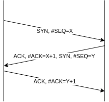
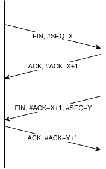
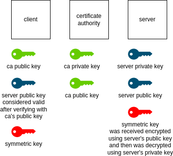
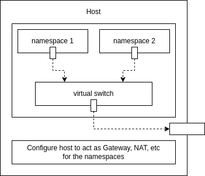

In this blog, I would cover my understanding of the TCP IP model.

# About

- protocol - a defined set of standards that computers follow to communicate
- the tcp ip model is a five layered model
- the osi model breaks the application layer into 3 separate layers

| Layer Number | Layer Name  | Protocol       | Protocol Data Unit | Addressing  |
|--------------|-------------|----------------|--------------------|-------------|
| 5            | Application | HTTP, SMTP     | Messages           | -           |
| 4            | Transport   | TCP, UDP       | Segments           | Ports       |
| 3            | Network     | IP             | Datagram           | IP Address  |
| 2            | Data Link   | Ethernet, Wifi | Frames             | MAC Address |
| 1            | Physical    | 10 Base T      | Bits               | -           |

# Cables

### Copper

- wires can be made up of multiple copper wires and insulated by plastic
- they simulate 1s and 0s by voltage changes
- crosstalk - when electrical pulse on one wire is detected by another wire, thus distorting the data
- cat5 < cat5e < cat6, based on crosstalk

### Fiber

- made up of optical fibers which are thin tubes of glass
- simulate 1s and 0s by light pulses

# Hubs

- a layer 1 device connected to multiple devices
- all devices receive the data, and the devices have to decide if the data was meant for them
- this forms a collision domain - a segment where only one device can send data, as transmission from multiple devices leads to collisions, thus distorting the data

# Switches

- a layer 2 device connected to multiple devices
- inspects the contents of the ethernet frame and accordingly forward the data
- leads to fewer retransmissions, lesser collision domains, higher throughputs

# Router

- a layer 3 device connected to multiple networks
- inspects the contents of IP datagram and accordingly forwards the data
- routers are of different types, e.g. ones at homes forward traffic from home devices to ISP
- routers have multiple network interfaces and so multiple MAC addresses

# Servers and Clients

- clients request for data
- servers serve data
- most nodes have multiple servers and clients running on them

# How Data Flows

1. message is encapsulated by tcp segment
2. tcp segment is encapsulated by ip datagram
3. ip datagram is encapsulated by ethernet frame

# Physical Layer

- the physical layer is used for transmitting bits
- modulation - the technique of varying voltage
- line coding - representing digital data (0s and 1s) using techniques like modulation
- cables are pairs of twisted copper wires, which help in preventing crosstalk
- cables are usually duplex i.e. allow communication in both ways
- this is contrary to simplex i.e. unidirectional flow of data
- duplex can be -
  - full duplex - allowing data flow in both directions simultaneously
  - half duplex - allowing data flow in only one direction at a time
- rj45 or registered jack 45 is a common plug
- plugs are connected to network ports which are present on the physical device

# Data Link Layer

- ethernet is used in this layer
- problem of collision domains was solved by csma-cd (carrier sense multiple access with collision detection) i.e. if a device finds that another device is already transmitting data on the segment, it waits for a random interval
- mac address is used in this layer

### Mac Addresses

- mac or media address control address helps in identifying which node the data was meant for
- mac addresses are globally unique ids, which are 48 bit hexadecimal numbers, with 6 octets  
- e.g. `11 22 33 aa bb cc`
- first three octets are oui (organizationally unique identifier) which help identify the manufacturer

### Methods of Data Transfer

- unicast - data is accepted by one receiver, lsb (least significant bit) of the first octet is set to 0
- multicast - data is accepted by multiple receivers, lsb of the first octet is set to 1
- broadcast - data is accepted by all the receivers, all hexadecimal digits are fs in the address

# Ethernet Frame Components

- preamble - to synchronize clocks
- source MAC address
- destination MAC address
- fcs - frame check sequence. it is used to perform crc (cyclical redundancy check) i.e. receiver verifies if transmitted data is valid
- vlan - virtual lan helps manage multiple lans. we group lans and give specific permissions to these groups
- payload, length, etc

# Network Layer

- ip addresses belong to the networks, not devices i.e. the ip of our device can change based on our location
- ip addresses can be -
  - static - configured on a node manually, used for network devices
  - dynamic - use dhcp (dynamic host configuration protocol) to assign a dynamic ip address, i.e. ip address of the device is not fixed
- fragmentation - data has to be split into several datagrams to be able to transmit
- the fragmented data then needs reassembling

# IP Datagram Components

- version - helps show if ipv4 or ipv6 is being used
- service type - qos (quality of service) helping routers know which ip datagrams are more important
- identification - datagrams which have the same identification number are a part of the same transmission. this happens as a result of fragmentation
- flag field - helps identify if the datagram has been fragmented
- fragmentation - helps order the datagrams while reassembling
- ttl - time to live i.e. how many times a datagram can hop. this value is decremented by one every time a datagram visits a router, so that there isn't an endless loop in case of an error as the value can't go below 0
- protocol - type of the datagram it encloses i.e. tcp, udp, etc
- header checksum - like the ethernet checksum. note: since ttl changes at every hop, so does checksum, so it needs to be recalculated every time
- source ip address
- destination ip address
- payload, length, etc

# ARP

- address resolution protocol
- an arp table is stored by devices for ip address to mac address mapping
- this is needed to wrap the ip datagram by an ethernet frame, i.e. the destination mac address
- the transmitting device can send a broadcast message (all fs) in its network to get the destination mac address
- arp tables expire after some time to account for the changes in the network

# Address Classes

| Class | Starting Bits | Bits for Network id | Bits for Host id | No. of Networks  | No. of Hosts / Network |
|-------|---------------|---------------------|------------------|------------------|------------------------|
| A     | 0             | 8                   | 32 - 8 = 24      | 28-1  | 224 - 2     |
| B     | 10            | 16                  | 32 - 16 = 16     | 216-2 | 216 - 2     |
| C     | 110           | 24                  | 32 - 24 = 8      | 224-3 | 28 - 2      |

# Subnetting

- subnetting is splitting a large network to subnets or smaller chunks
- built on top of address classes
- IP addresses are now divided into 3 parts - network id, subnet id and host id
- core routers are only concerned with the network id and send to the correct gateway routers
- then the gateway routers get it to the host

example -

| #               | Octet 1  | Octet 2  | Octet 3  | Octet 4  |
|-----------------|----------|----------|----------|----------|
| **IP Address**  | 9        | 100      | 100      | 100      |
| **Subnet Mask** | 11111111 | 11111111 | 11111111 | 11100000 |

1. since IP address starts with a 9, it is class A, so network id, 8 bits is 00001001
2. perform "and" operation of ip address with subnet mask, remove bits for network id, remaining 19 bits i.e. 01100100.01100100.011 is subnet id
3. remaining 5 bits are for host id, out of which 2 addresses are not available - all 0s for host id and all 1s for host id, where all 1s is used for broadcast

another way to represent - 9.100.100.100/27

# CIDR

- traditional subnetting was not enough, as bits for network ids are not flexible
- e.g. some companies brought many class C to combat this issue
- therefore we came up with CIDR (classless inter-domain routing)
- with CIDR, network and subnet id are combined into one
- e.g. 9.100.100.100/24 means 24 bits for net mask

# Routing

routers are connected in a mesh topology to survive failures and route data efficiently. the process of forwarding data in routers is described below

- an ethernet frame reaches the router's interface
- the ethernet frame is removed to extract the ip datagram
- the destination ip on the ip datagram is inspected
- it will use different algorithms to find the best possible way to forward the data
- it will reduce the ttl of the ip datagram
- it will therefore recalculate the checksum and set it on the ip datagram
- it now has to construct the new ethernet frame
- the source mac will be its interface's mac address
- it can get the mac address of the next hop using its arp table (or cache it if there is no corresponding entry), which is used for the destination mac address in the ethernet frame
- encapsulate the ip datagram and forward the ethernet frame

# Route Table Components

- destination network - store the network id and net mask
- a catch-all entry to forward data to if it cannot find any corresponding destination network
- next hop - the next device to go to
- total hops - the total hops, continuously updated, to reach the destination network
- interface - routers have multiple interfaces, so it should know which interface to use for the current datagram

# Exterior Gateway Protocols

- bgp - border gateway protocol
- share data across different organizations
- core internet routers try to get the data to the edge routers
- edge routers / gateway routers sit on the entry and exit point of autonomous networks
- core routers need to know how to efficiently route data to autonomous systems, and therefore a 32 bit asn (autonomous system number) is assigned to autonomous systems
- asn is not an ip address, it doesn't change frequently like ip addresses, and is not used by humans

# Interior Gateway Protocols

- interior gateway protocols are used for routing data in a single, autonomous network
- can be of two types - distance vector and link state

### Distance Vector Protocol

- older standard
- has all information about itself and immediate neighbors
- because of this, it is slow to react to the changes in a network far from it

### Link State Protocol

- newer standard
- each router broadcasts its state to all the other routers
- all routers have information about all the other routers
- so more complex algorithms are used and more memory and processing power is needed

# Non Routable Address Space

- ipv4s are not enough to accommodate for the number of devices
- so some ranges of IP addresses were reserved, so that they are just for use within an autonomous system
- three of them are - 10.0.0.0/8, 172.16.0.0/12, 192.168.0.0/16

# Transport Layer

- multiplexing - transport layer sends data from the multiple applications on a node packaged as a whole
- demultiplexing - transport layer receives data and breaks it down to send it to the correct application
- ports, which are 16-bit numbers are used to achieve multiplexing and demultiplexing
- specific ports are used for specific application protocols e.g. port 80 for http, port 21 for ftp
- if `10.1.1.100` is the IP address, `10.1.1.100:80` is the socket address
- sockets - a socket can be in various states, and it needs to be opened on a port for transmission of traffic
- deciding when to try resending of data in case of a failure is only done by transport layer, as it receives ack

### Ports

- system ports - also called well known ports, range 1-1023, for common services e.g. http port 80
- registered ports - range 1024-49151, for not as common services e.g. database 3306
- ephemeral ports - also called private ports, range 49152-65535, used by clients

### UDP

- tcp has a lot of overhead
- to prevent this, for cases like streaming videos, udp or user datagram protocol is used
- udp doesn't have acknowledgments

# TCP Segment Components

- source port - one of the ephemeral ports
- destination port - like http port 80
- sequence number - 32-bit number, since data is split, it helps identify which tcp segment the data is a part of
- acknowledgement number - the next expected segment number
- control flags - there are 6 flags, so 6 bits
  - urg - urgent, indicates that the segment is urgent
  - ack - acknowledgement, indicates that the acknowledgement number field should be examined
  - psh - push, indicates that the transmitting device wants the receiving device to push buffered data to application as soon as possible. buffers help group the chunks of data to make transmission efficient
  - rst - reset, indicates that the sending side has error
  - syn - synchronize, indicates that the sequence number field should be examined
  - fin - finish, indicates that the sending side wants to end the connection
- tcp window - range of sequence numbers before an acknowledgement is required
- checksum

  

  
  # 3 Way Handshake
  
  3 way handshakes are used to establish a connection
  
  
  
  

  

  
  # 4 Way Handshake
  
  4 way handshakes are used to end a connection
  
  
  
  

# Application Layer

- payload of tcp segments contain the message sent by applications
- protocols like http, smtp, etc. need to be followed, irrespective of the application
- osi model divides application layer into session, presentation and application

# Name Resolution

- why dns
  - domain name system
  - resolves string to ip addresses for us, as strings are easier to use by humans
  - it also helps change the ip address behind the scenes (e.g. changing the location of a server) without the end user getting affected
  - web servers distributed across the globe helps resolve the name to the closest server
- www.example.com is a fqdn i.e. fully qualified domain name where
  - www is the sub domain
  - example is the domain
  - com is the top level domain
- 5 types of dns servers - caching name server, recursive name servers, root name servers, tld name servers and authoritative name servers
- caching name servers are provided by isp, to cache the domain name lookups for performance. a small ttl is used to keep the cache fresh to accommodate for changes
- recursive name servers facilitate the resolving of name to ip address
- recursive name servers contact the root name server first, which directs to the correct tld name server
- the tld servers then redirects the recursive name server to the correct authoritative name server
- caching and recursive name servers can be merged into one
- udp is used for dns traffic. so, in case of error, the request is made again i.e. in case when traffic is of type tcp, errors are handled at transport layer (when an ack response isn't received), but here, the application layer handles requesting for the data again
- different resource record types allow different kinds of dns name resolutions
- resource record types -
  - a record - it is used to point a domain name to an ipv4 address. a single domain name can have multiple "a records", allowing to load balance traffic e.g. using round robbin
  - cname record - canonical name record, helps redirect traffic from one domain to another. this way, if ip address changes, we need to update the change at only one place
  - aaaa record - also called "quad a record", used for ipv6 address
  - mx record - mail exchange, helps forward email traffic to the mail server of the company
  - srv record - service record, location of specific services like calendar and scheduling
  - txt record - text record, metadata for humans, nowadays for storing common configuration as well and then devices parse it
- we buy domains from a domain registrar
- a dns service is used for managing dns records
- we can use the same company as the domain registrar and the dns service
- when we use a different company for a domain registrar and dns service, we need to update the ns (namespace) records of the domain registrar to point to the dns service' name servers
- 8.8.8.8 is the public dns service provided by google
- we can use `nslookup` / `dig` command line tools, e.g. `dig www.google.com`

# DHCP

- dynamic host configuration protocol
- every host needs to get these four configurations - ip address, subnet mask, gateway, name server
- dhcp helps assign these configurations dynamically
- allocation strategies -
  - dynamic allocation - hosts can get any ip address from the pool of available addresses
  - automatic allocation - dhcp server tries to assign the host the same address if possible
  - fixed allocation - based on mac address, allow ip address to be assigned
- dhcp server runs on port 67, dns requests are made by a client from port 68
- dhcp server sends messages to the broadcast address, since the client doesn't yet have an ip address. since it's a broadcast, all clients receive it, and the original client identifies itself with the message using its mac address
- dhcp discovery -
  - discover - sent from client to dhcp server, source ip is 0.0.0.0:68 and destination ip is 255.255.255.255:67
  - offer - sent from dhcp server to client, source ip is the actual ip of the dhcp server and destination ip is 255.255.255.255:68
  - request - sent from client to dhcp server, source ip is 0.0.0.0:68 and destination ip is 255.255.255.255:67
  - acknowledge - sent from dhcp server to client, source ip is the actual ip of the dhcp server and destination ip is 255.255.255.255:68
- the entire configuration is called a dhcp lease, which may last for few days, after which the client returns the lease to the dhcp server to release the address

# NAT

- network address translation
- helps in transforming one IP address to another
- this is done by the nat gateway, as it
  - rewrites the source IP in outbound packets
  - rewrites the destination IP in inbound packets
- also called IP masquerading, as no one can establish a connection to the host without going via the gateway
- it is used for security and is limited to ipv4
- it is used to give internet access to private networks
- this way only one public ip is used by all the devices on the private network
- techniques like port preservation are used to achieve this, the goal is to remember the client port which was used and map it to the corresponding port of the gateway

# TLS and PKI

- tls - transport layer security and pki - public key infrastructure
- symmetric encryption - the same key is used to encrypt and decrypt data
- asymmetric encryption - there is a public key and a private key. one of them is used to encrypt data while the other one is used to decrypt data
- first, the server sends us the public key and keeps the private key to itself
- now, we encrypt the symmetric key using the public key and send it to the server. since only the server has the private key, only it can decrypt the message to retrieve the symmetric key
- now since both the server and the client have the symmetric key and no one else does, they can safely start encrypting and decrypting messages using it for all further communication
- second issue - how to trust the public key sent? what if there is a phishing attack i.e. the entire process discussed above is repeated, but the server itself is fraudulent
- so, the public keys instead of being sent by themselves, are a part of a certificate
- we generate certificates and then get them signed by ca or certificate authorities
- to validate the cas themselves, the signing is done by the cas using a private key, while the browsers have the public keys of the cas. e.g. to view them in chrome browsers, we can navigate to settings &#10141; privacy and security &#10141; security &#10141; manage certificates &#10141; authorities
- companies can manage the browsers of employees and embed custom ca public keys into them while having a self-hosted version of a ca server alongside

# Network Namespaces

- we can divide the network into namespaces to create isolated sandboxes
- this technique is used by docker as well
- however, the namespace itself has no visibility of the host configuration like arp tables of the host etc
- we have to create an interface on the namespaces to enable communication
- we create a switch, just like in case of normal hosts, to enable intercommunication between namespaces
- now, the switch is also like an interface for the host, thus helping the namespaces communicate with the world outside the host through another interface of the host
- just like normal hosts need functionality like gateway, nat, etc., all this is now provided by the host which contains the namespaces

# Miscellaneous Debugging in Linux

- to view all interfaces, use `ip link`
- to view the route table, use `route`
- to view the arp table, use `arp`
- if host can transfer packets from one interface to another depends on whether the output of `/proc/sys/net/ipv4/ip_forward` has value as 1 or 0
- view dns resolutions configured on the host via `/etc/hosts`. this is more for dns resolutions which we do not want to happen via the dns server(s)
- we can look at the dns servers configured for the host via `/etc/resolv.conf`
  - in here, we can also have entries of the form `search xyz.com pqr.company.org`. this means when we hit a website without its fqdn (fully qualified domain name), it will automatically try appending `xyz.com` and `pqr.company.org` to the name we provide and then carry out the dns resolution
- both `dig xyz.com` and `nslookup xyz.com` can be used to test dns resolution. dig returns more information. however, both do not take into account what is stored in `/etc/hosts`, they simply query the dns server
- list the network namespaces using `ip netns`
- now to run commands like `route` etc. on namespaces, use `ip netns exec <<namespace-name>> route`
