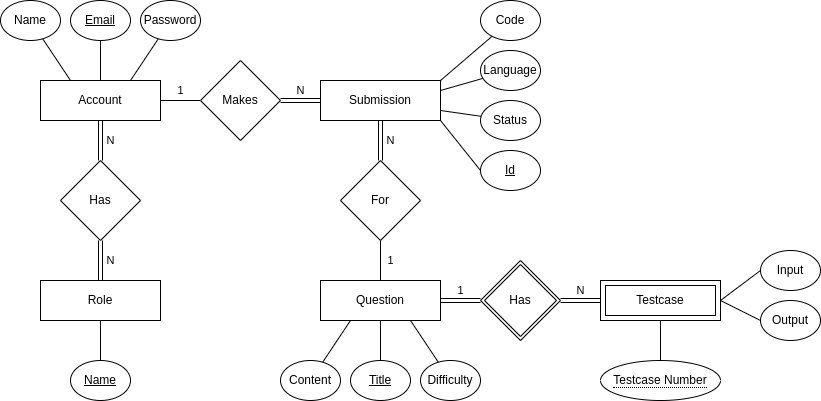

The project is about making an online portal where users can come in to submit their solutions to programming problems. In other words, it is a basic rip-off of [Leetcode](https://leetcode.com/). My friend, [Yash Maniramka](https://gitlab.com/iamyashm) worked on the Frontend bit of it using VueJS while I worked on Backend and Devops. In this post, I would be talking about the application itself and the parts that I worked on. The source code for the project can be found [here](https://gitlab.com/shameekagarwal/online-judge).

### Actors in the Application

- `users` are the people who submit their solutions to problems in a programming language of their choice.
- `managers` can access various actuator endpoints for monitoring the health and status of the application. They can also perform operations like changing the log level during runtime.
- `admins` can create questions with testcases and delete questions.

### Demo

<video controls>
  <source src="online-judge/demo.mp4" type="video/mp4">
</video>
 
 

### Microservices

DDD has been used to split the backend into three different services - account service, question service and submission service.

Account service has endpoints for creating a user and logging in a user i.e. returning the JWT token if the credentials are valid. It also has an endpoint for creating the initial roles and superusers.

Question service has endpoints for creating a question, listing questions, deleting a question and fetching a question details. For returning the question details, the question service also calls the submission service for fetching the submissions of the user (if logged in).

Submission service has an endpoint for creating a submission which then gets evaluated asynchronously in the backend. It also has endpoints for fetching all the submissions for a particular question for the logged-in user and fetching analytics which returns details about the total number of passed and failed submissions for a question. It also listens for events of creation of an account and creation / deletion of a question. This is required so that the submission service can maintain mappings for submissions to accounts and questions in its database.

### Data Model

Polyglot persistence has been used in the application to increase fault tolerance, so each service has its own database (technically, each service has a separate schema in the same database). This is an ER diagram, and the actual attributes after the application was developed may differ a little.

 

### Backend Implementation Details

A maven multimodule project has been used. This helps in using a shared folder, where all common functionality like parsing JWT, error handling, etc. are present. This project follows a mono repo pattern.

Spring Boot has been used for implementing the backed. Hibernate Validator has been used for validating the DTOs. Spring Data JPA has been used for implementing the DAO layer and the database used is MySQL. Database migrations are handled via Flyway. Spring Batch has been used for evaluating the submissions against testcases in batches. Actuator has also been used for monitoring the application during runtime. The application implements RBAC using JWT and Spring Security.

For implementing microservices patterns, Netfllix Eureka has been used for Discovery Server and Client Side Load Balancing, Spring Cloud Config for managing configuration using a config-first approach and Spring Cloud Gateway to expose the different microservices from a common endpoint i.e. the services cannot be accessed directly. Resilience4J and Open Feign have been used for synchronous communication and RabbitMQ for asynchronous communication.

Tests for the backend have been written using Junit, Mockito and Spring's support for testing, with primary focus on integration tests using the inmemory database H2.

### Devops Implementation Details

Docker along with Docker-Compose has been used.

Different AWS services have been used, e.g. IAM, ECS and ECR for managing Docker, components of VPC including NAT Gateways, Internet Gateway, etc. to set up a sandboxed environment, S3 for serving the static frontend files, RDS and Amazon MQ for backing services, ALB for exposing the backend, Cloudwatch for logs and EC2 for a bastion. The backing services and ECS containers are launched in the private subnet. The backing services can only be accessed via the bastion which helps in, for instance, running the initial database scripts like creating database schemas and setting up users.

IAC has been implemented via Terraform. Terraform workspaces help in setting up different environments for development, staging and production. For managing secrets like database user passwords, terraform variables have been used which are injected through Gitlab CI-CD variables. The state is managed via S3 + DynamoDB.

Gitlab pipelines are used for implementing CI/CD. It offers a rich set of features used in this project like artifacts, cache, DIND, parent-child and DAG pipelines to name a few. Gitlab is also used for issue tracking in this project.
